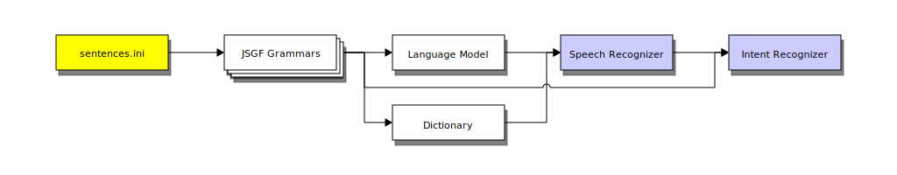

# About

Rhasspy was created and is currently maintained by [Michael Hansen](https://synesthesiam.com/).


Special thanks to:

* [maxbachmann](https://github.com/maxbachmann)
* [koenvervloesem](https://github.com/koenvervloesem)
* [fastjack](https://community.rhasspy.org/u/fastjack)
* [KiboOst](https://github.com/KiboOst)
* [Romkabouter](https://github.com/Romkabouter)
* [FunkyBoT](https://community.home-assistant.io/u/FunkyBoT)
* [S_n_Nguy_n](https://community.home-assistant.io/u/S_n_Nguy_n)

## Supporting Tools

The following tools/libraries help to support Rhasspy:

* [alpinejs](https://github.com/alpinejs/alpine/) (web UI)
* [eSpeak](http://espeak.sourceforge.net) (text to speech)
* [DeepSpeech](https://github.com/mozilla/DeepSpeech) (speech to text)
* [flite](http://www.festvox.org/flite) (text to speech)
* [Hypercorn](https://pgjones.gitlab.io/hypercorn) (web server)
* [Kaldi](https://kaldi-asr.org) (speech to text)
* [KenLM](https://kheafield.com/code/kenlm/) (language modeling)
* [MaryTTS](http://mary.dfki.de) (text to speech)
* [Montreal Forced Aligner](https://montreal-forced-aligner.readthedocs.io/en/latest/) (acoustic models)
* [mosquitto](https://mosquitto.org/) (MQTT broker)
* [Mycroft Precise](https://github.com/MycroftAI/mycroft-precise)
* [nanoTTS](https://github.com/gmn/nanotts) (text to speech)
* [Opengrm](http://www.opengrm.org/twiki/bin/view/GRM/NGramLibrary) (language modeling)
* [paho](https://www.eclipse.org/paho/) (network communication)
* [Phonetisaurus](https://github.com/AdolfVonKleist/Phonetisaurus) (word pronunciations)
* [PicoTTS](https://en.wikipedia.org/wiki/SVOX) (text to speech)
* [Pocketsphinx](https://github.com/cmusphinx/pocketsphinx) (speech to text, wake word)
* [porcupine](https://github.com/Picovoice/Porcupine) (wake word)
* [PyAudio](https://people.csail.mit.edu/hubert/pyaudio/) (microphone)
* [Python 3.7](https://www.python.org)
* [Quart](https://gitlab.com/pgjones/quart) (web framework)
* [rapidfuzz](https://github.com/maxbachmann/rapidfuzz) (fuzzy string matching)
* [Snips NLU](https://github.com/snipsco/snips-nlu) (intent recognition)
* [snowboy](https://snowboy.kitt.ai) (wake word)
* [Sox](http://sox.sourceforge.net) (WAV conversion)
* [supervisord](http://supervisord.org/) (service management)
* [webrtcvad](https://github.com/wiseman/py-webrtcvad) (voice activity detection)
* [Zamia Speech](https://github.com/gooofy/zamia-speech) (acoustic models)

<p>This project is supported by:</p>
<p>
  <a href="https://www.digitalocean.com/">
    
  </a>
</p>

## History

Rhasspy was originally inspired by [Jasper](https://jasperproject.github.io), an "open source platform for developing always-on, voice-controlled applications". Rhasspy's original architecture (v1) was close to Jasper's, though the two systems handled speech/intent recognition in very different ways.

### Jasper

Jasper runs on the Raspberry Pi's and is extendable through custom Python modules. It's also highly configurable, featuring multiple speech recognition engines, text to speech systems, and integration with online services (Facebook, Spotify, etc.).

Speech recognition in Jasper is done using [pocketsphinx](https://github.com/cmusphinx/pocketsphinx), specifically with the *keyword search* mode. User modules declare a list of `WORDS` that Jasper should listen for. The union set of all module `WORDS` is listened for at runtime, and transcriptions are given to the `isValid` functions of each module in `PRIORITY` order. When one returns `True`, Jasper calls the `handle` function to perform the module's intended action(s).

```python
# ---------------------
# Example Jasper Module
# ---------------------

# Orders modules in case of a conflict
PRIORITY = 1

# Bag of words for keyword search
WORDS = ["MEANING", "OF", "LIFE"]

# Return true if transcription is valid for module
def isValid(text):
    return re.search(r"\bmeaning of life\b", text, re.IGNORECASE)

# Handle transcription
def handle(text, mic, profile):
    mic.say("It's 42")
```

### Rhasspy v1

The first version of Rhasspy (originally named "wraspy") followed Jasper in its use of pocketsphinx for speech recognition, but with an [ARPA language model](https://cmusphinx.github.io/wiki/arpaformat/) instead of just keywords. Rhasspy user modules (similar in spirit to Jasper's) provided a set of *training sentences* that were compiled into a statistical model using [cmuclmtk](https://sourceforge.net/cmusphinx), a language modeling toolkit.

Inspired by the Markdown-like language used in the [rasaNLU](https://rasa.com/) training data format, sentences were annotated with extra information to aid in post-processing. For example, the sentence `turn on the living room lamp` might be annotated as `turn [on](state) the [living room lamp](name)`. While pocketsphinx would recognize the bare sentence, the Rhasspy user module would receive a pre-processed **intent** with `state` and `name` **slots**. This greatly simplified the user module handling code, since the intent's slots could be used directly instead of requiring upfront text processing in each and every module.

Example part of a Rhasspy v1 user module:

```python
def get_training_phrases(self):
    """Returns a list of annotated training phrases."""
    phrases = []

    # Create an open/closed question for each door
    for door_name in self.doors:
        for state in ["open", "closed"]:
            phrases.append([
                'is the [{0}](location) door [{1}](state)?'.format(door_name, state)
            ])
        
    return phrases
```

Some limitations with this approach become apparent with use, however:

* Training sentences with optional words or multiple values for a slot must be constructed in code
* There is no easy way to get an overview of what voice commands are available
* Intent handling is baked into each individual module, making it difficult to interact with other IoT systems (e.g., [Node-RED](https://nodered.org))
* Users unfamiliar with Python cannot extend the system

Rhasspy v1 shared many of the same sub-systems with Jasper, such as pocketsphinx for wake word detection, [phonetisaurus](https://github.com/AdolfVonKleist/Phonetisaurus) for guessing unknown word pronunciations, and [MaryTTS](http://mary.dfki.de) for text to speech.

### Rhasspy v1.5

To address the limitations of v1, a [version of Rhasspy](https://github/synesthesiam/old-custom-components) was developed as a set of *custom components* in [Home Assistant](https://www.home-assistant.io/), an open source IoT framework for home automation. In this version of Rhasspy (dubbed v1.5 here), users ran Rhasspy as part of their Home Assistant processes, controlling lights, etc. with voice commands.

In contrast to v1, there were no user modules in v1.5. Annotated training sentences were provided in a single Markdown file, and intents were handled directly with the built-in scripting capability of [Home Assistant automations](https://www.home-assistant.io/docs/automation). This allowed non-programmers to extend Rhasspy, and dramatically increased the reach of intent handling beyond simple Python functions.

Example Rhasspy v1.5 training sentences:

```
## intent:ChangeLightState
- turn [on](state) the [living room lamp](name)
- turn [off](state) the [living room lamp](name)
```

Support for new sub-systems was added in v1.5, specifically the [snowboy](https://snowboy.kitt.ai) and [Mycroft Precise](https://github.com/MycroftAI/mycroft-precise) wake word systems. Some additional capabilities were also introduced, such as the ability to ["mix" the language model](training.md#language-model-mixing) generated from training sentences with a larger, pre-trained language model (usually generated from books, newspapers, etc.).

While it was met with some interest from the Home Assistant community, Rhasspy v1.5 could not be used in [Hass.io](https://www.home-assistant.io/hassio/), a [Docker](https://www.docker.com)-based Home Assistant virtual appliance. Additionally, [Snips.AI](https://snips.ai/) had a great deal of momentum already in this space (offline, Raspberry Pi IoT) for English and French users. With this in mind, Rhasspy pivoted to work as a Hass.io add-on with a greater focus on non-English speakers.

### Rhasspy v2

Version 2 of Rhasspy was re-written from scratch using an [actor model](https://en.wikipedia.org/wiki/Actor_model), where each actor runs in a separate thread and passes messages to other actors. All sub-systems were represented as stateful actors, handling messages differently depending on their current states. A central *Dialogue Manager* actor was responsible for creating/configuring sub-actors according to a user's *profile*, and for responding to requests from the user via a web interface.


Messages between actors included audio data, requests/responses, errors, and internal state information. Every behavior in Rhasspy v2 was accomplished with the coordination of several actors.

The notion of a **profile**, borrowed originally from Jasper, was extended in v2 to allow for different languages. As of August 2019, Rhasspy v2 supported 13 languages (with varying degrees of success). Compatible pocketsphinx models were available for many of the desired languages, but it was eventually necessary to add support for [Kaldi](https://kaldi-asr.org), a speech recognition toolkit from Johns Hopkins. With the Kaldi acoustic models released for the [Montreal Forced Aligner](https://montreal-forced-aligner.readthedocs.io/en/latest/), Rhasspy has access to many languages that are not commonly supported.

A major change from v1.5 was the introduction of **sentences.ini**, a new format for specifying training sentences. This format uses simplified [JSGF grammars](https://www.w3.org/TR/jsgf/) to concisely describe sentences with optional words, alternative clauses, and re-usable rules. These sentence *templates* are grouped using ini-style blocks, which each represent an intent.

```
[ChangeLightState]
states = (on | off)
turn (<states>){state} the (living room lamp){name}
```

During the training process, Rhasspy v2 generated **all possible** annotated sentences from `sentences.ini`, and used them to train both a speech and intent recognizer. Transcriptions from the speech recognizer were fed directly into the intent recognizer, which had been trained to receive them!



Besides the addition of Kaldi, Rhasspy v2 included support for multiple intent recognizers and basic integration with Snips.ai via the [Hermes protocol](https://docs.snips.ai/ressources/hermes-protocol). This MQTT-based protocol allowed Rhasspy to receive remote microphone input, play sounds/speak text remotely, and be woken up by a Snips.ai server. Because of Rhasspy's extended language support, this made it possible for Snips.ai users to swap out the speech-to-text module with Rhasspy while keeping the rest of their set-up intact.

Through its REST API and a websocket connection, Rhasspy was also able to interact directly with [Node-RED](https://nodered.org), allowing users to create custom **flows** graphically. These flows could respond to recognized intents from Rhasspy, further extending Rhasspy beyond only devices that Home Assistant could control.

### Rhasspy v2.4 and the Death of Snips

Generating all possible training sentences in Rhasspy v2 was done using a [finite state transducer](http://www.openfst.org). While fast for small assistants, it could not scale. Thanks to the [opengrm toolkit](http://www.opengrm.org), the process of generating sentences could be bypassed entirely by going straight to a language model! Overnight, Rhasspy was suddenly capable of training millions of possible voice commands in a few seconds.

Rhasspy 2.4 added support for more languages, speech systems, and intent recognizers. It continues to be maintained and can be installed via Docker, Hass.IO, and within a virtual environment. While this version of Rhasspy is stable and usable for many users, its architecture is inherently monolithic. As a single Python application, contributors must understand a great deal about Rhasspy's internals before making any modifications. Additionally, installations of Rhasspy with only a subset of its components is difficult and fragile (a single global `import` of an optional dependency will break everything). To broaden the base of potential contributors and make installation more modular, a new architecture was needed.

When Snips.AI announced they had been bought by Sonos in 2019, development plans for Rhasspy 2.5 pivoted to fill in the gap. By fracturing Rhasspy into multiple [services](services.md) that communicate over an MQTT broker using an extended version of the Hermes protocol, Rhasspy 2.5 aims to:

* Maintain compatibility with Rhasspy 2.4 profiles and APIs
* Enable contributors to write Rhasspy apps/skills in any language that can speak MQTT and JSON
* Provide a migration path for Snips skill authors to move their Hermes-based services to Rhasspy
* Allow for individual Rhasspy components to be developed independently in separate repositories
* Make modular installations possible, with any combination of individual services
