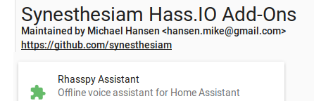
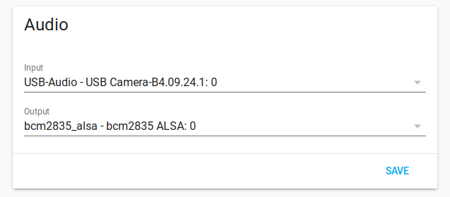

# Install

Rhasspy can be installed in several different ways. The easiest way is [with Docker](#docker), which will pull a 1.5-2GB image with all of the [officially supported services](https://github.com/rhasspy/rhasspy).

## Docker

The easiest way to try Rhasspy is with Docker. To get started, make sure you have [Docker installed](https://docs.docker.com/install/):

```bash
$ curl -sSL https://get.docker.com | sh
```

and that your user is part of the `docker` group:

```bash
$ sudo usermod -a -G docker $USER
```

**Be sure to reboot** after adding yourself to the `docker` group!

Next, start the [Rhasspy Docker image](https://hub.docker.com/r/rhasspy/rhasspy) in the background:

```bash
$ docker run -d -p 12101:12101 \
      --name rhasspy \
      --restart unless-stopped \
      -v "$HOME/.config/rhasspy/profiles:/profiles" \
      -v "/etc/localtime:/etc/localtime:ro" \
      --device /dev/snd:/dev/snd \
      rhasspy/rhasspy \
      --user-profiles /profiles \
      --profile en
```

This will start Rhasspy with the English profile (`en`) in the background (`-d`) on port 12101 (`-p`) and give Rhasspy access to your microphone (`--device`). Any changes you make to [your profile](profiles.md) will be saved to `/home/<YOUR_USER>/.config/rhasspy`.

Once it starts, Rhasspy's web interface should be accessible at [http://localhost:12101](http://localhost:12101). If something went wrong, trying running docker with `-it` instead of `-d` to see the output.

If you're using [docker compose](https://docs.docker.com/compose/), add the following to your `docker-compose.yml` file:

```yaml
rhasspy:
    image: "rhasspy/rhasspy"
    container_name: rhasspy
    restart: unless-stopped
    volumes:
        - "$HOME/.config/rhasspy/profiles:/profiles"
        - "/etc/localtime:/etc/localtime:ro"
    ports:
        - "12101:12101"
    devices:
        - "/dev/snd:/dev/snd"
    command: --user-profiles /profiles --profile en
```

Rhasspy runs an MQTT broker inside the Docker image on port `12183` by default. Connecting to this broker will let you interact with Rhasspy over its [MQTT API](reference.md#mqtt-api).

### Raspberry Pi Zero

Docker on the Raspberry Pi Zero appears to be broken, and will pull the wrong Docker image by default. To fix this, you must enable "experimental" features in your Docker daemon and explicitly specify the platform.

First, edit your `/etc/docker/daemon.json` file (create it if it doesn't exist using `sudo`) and add the following content:

```json
{
  "experimental": true
}
```

Next, restart your Docker daemon by running:

```bash
$ sudo systemctl restart docker
```

Finally, pull the correct Docker image:

```bash
$ docker pull --platform linux/arm/v6 rhasspy/rhasspy
```

### Updating

To update your Rhasspy Docker image, simply run:

```bash
$ docker pull rhasspy/rhasspy
```

If you're using a Raspberry Pi Zero, make sure to specify the platform:

```bash
$ docker pull --platform linux/arm/v6 rhasspy/rhasspy
```

After pulling the latest Rhasspy image, your Rhasspy container is still based on the old image. So to apply the update to your running Rhasspy instance, you also have to:

* Stop the container: `docker stop rhasspy`
* Remove the container: `docker rm rhasspy`
* Create the container again with your original `docker run` command.

After this, the Rhasspy container is running from the newest image you downloaded with the `docker pull` command.

If you're using Docker Compose to run Rhasspy, just go into the directory of your `docker-compose.yml` file and execute the following commands:

```bash
$ docker-compose pull
$ docker-compose up -d
```

The first command downloads the latest Rhasspy image and the second command recreates your container from this new image.

---

## Debian

Pre-compiled packages are available for Debian-based distributions (Ubuntu, Raspberry Pi OS, etc.) on `amd64`, `armhf`, `armel`, and `arm64` (`aarch64`) architectures. These packages are built using Docker and `dpkg`.

Download the appropriate `.deb` file for your CPU architecture:

* [amd64](https://github.com/rhasspy/rhasspy/releases/download/v2.5.8/rhasspy_2.5.8_amd64.deb) - Desktops, laptops, and servers
* [armhf](https://github.com/rhasspy/rhasspy/releases/download/v2.5.8/rhasspy_2.5.8_armhf.deb) - Raspberry Pi 2, and 3/3+ (armv7)
* [arm64](https://github.com/rhasspy/rhasspy/releases/download/v2.5.8/rhasspy_2.5.8_arm64.deb) - Raspberry Pi 3+, 4
* [armel](https://github.com/rhasspy/rhasspy/releases/download/v2.5.8/rhasspy_2.5.8_armel.deb) - Raspberry Pi 0, 1

If you're unsure about your architecture, run:

```bash
$ dpkg-architecture | grep DEB_BUILD_ARCH=
```

which will output something like:

```bash
DEB_BUILD_ARCH=amd64
```

Note that this *should* be `armel` for the Raspberry Pi Zero, but it may lie and say `armhf`.

Next, install the `.deb` file:

```bash
$ sudo apt install /path/to/rhasspy_<VERSION>_<ARCH>.deb
```

where where `<VERSION>` is Rhasspy's version (probably 2.5.X) and `<ARCH>` is your build architecture.

Now you can run `rhasspy` from the command-line:

```sh
$ rhasspy --profile en
```

and access the web interface at [http://localhost:12101](http://localhost:12101)

To upgrade in the future, you can remove Rhasspy with `sudo dpkg -r rhasspy` and then install the new Debian package.

---

## Virtual Environment

See the [Github documentation](https://github.com/rhasspy/rhasspy). On a Debian system, you should only need to install the necessary dependencies:

```bash
$ sudo apt-get update
$ sudo apt-get install \
       python3 python3-dev python3-setuptools python3-pip python3-venv \
       git build-essential libatlas-base-dev swig portaudio19-dev \
       supervisor mosquitto sox alsa-utils libgfortran4 libopenblas-dev \
       espeak flite \
       perl curl patchelf ca-certificates
```

and then clone/build:

```bash
$ git clone --recursive https://github.com/rhasspy/rhasspy
$ cd rhasspy/
$ ./configure --enable-in-place
$ make
$ make install
```

This will install Rhasspy inside a virtual environment at `$PWD/.venv` by default with **all** of the supported speech to text engines and supporting tools. When installation is finished, copy `rhasspy.sh` somewhere in your `PATH` and rename it to `rhasspy`.

The `--enable-in-place` option will use the source files in the Rhasspy submodules (e.g., `rhasspy-nlu-hermes/rhasspynlu_hermes`) directly instead of installing them with `pip`. This allows you to change the code and simply re-run `rhasspy.sh` with the modifications.

### Customizing Installation

You can pass additional information to `configure` to avoid installing parts of Rhasspy that you won't use. For example, if you only plan to use the French language profiles, set the `RHASSPY_LANGUAGE` environment variable to `fr` when configuring your installation:

```bash
$ ./configure RHASSPY_LANGUAGE=fr --enable-in-place
```

The installation will now be configured to install only Kaldi (if supported). If instead you want a specific speech to text system, use `RHASSPY_SPEECH_SYSTEM` like:

```bash
$ ./configure RHASSPY_SPEECH_SYSTEM=deepspeech --enable-in-place
```

which will only enable DeepSpeech (on supported platforms). The `RHASSPY_WAKE_SYSTEM` variable controls which wake system is installed, such as `precise` or `porcupine`.

To force the supporting tools to be built from source instead of downloading pre-compiled binaries, use `--disable-precompiled-binaries`. Dependencies will be compiled in a `build` directory (override with `$BUILD_DIR` during `make`), and bundled for installation in `download` (override with `$DOWNLOAD_DIR`).

See `./configure --help` for additional options.

### Updating

To update your Rhasspy virtual environment, you must update your code and any dependencies:

```bash
$ git submodule foreach git pull origin master
$ git pull origin master
$ ./configure --enable-in-place
$ make
$ make install
```

---

## Hass.io

If you use [Home Assistant](https://www.home-assistant.io), you can install Rhasspy as a [Hass.io add-on](https://www.home-assistant.io/addons/). Follow the [installation instructions for Hass.io](https://www.home-assistant.io/hassio/installation/) before proceeding.

To install the add-on, add [this Hass.IO Add-On Repository](https://github.com/synesthesiam/hassio-addons) in the Add-On Store, refresh, then install the "Rhasspy Assistant **2.5**" under “Synesthesiam Hass.IO Add-Ons” (all the way at the bottom of the Add-On Store screen).



Before starting the add-on, make sure to give it access to your microphone and speakers:



### Updating Hass.IO Add-On

You should receive notifications when a new version of Rhasspy is available for Hass.IO. Follow the instructions from Hass.IO on how to update the add-on.

---

## Windows Subsystem for Linux (WSL)

If you're using Windows, you can run Rhasspy inside WSL and access its web interface from Windows. This setup is mainly
useful when you want to work on the Rhasspy source code. If you just plan to use it as an end user you should stick
to Docker.

### Prequisites

This documentation assumes that you have already set up a WSL environment. If not, you can do that by following
[this guide](https://docs.microsoft.com/en-us/windows/wsl/install-win10). It is recommended to use Debian or a derivate
like Ubuntu. The following steps were tested on Ubuntu 20.04 running in WSL 2.

### Rhasspy

Installing Rhasspy is basically the same procedure as if you were running Linux natively. Open your WSL terminal and
follow the steps from the section [Virtual Environment](#virtual-environment).

After you have started Rhasspy, open a web browser **in Windows** and open http://localhost:12101. You should see the
Rhasspy web interface.

You could use Rhasspy now, but you won't hear anything and can't interact with it with your voice because audio is not
working. Stick to the next section to learn how to fix that.

### Enabling audio

WSL does not natively support audio devices. Fortunately, there is a solution for that: You can run a PulseAudio server
on the Windows side and tell your PulseAudio clients in WSL to use the Windows PulseAudio server over the network.

#### Installation on Windows

You can find [pre-build binaries for Windows on this website](https://www.freedesktop.org/wiki/Software/PulseAudio/Ports/Windows/Support/).
After downloading the zip file, extract it and make the following config changes:

**etc/pulse/default.pa**:

```
From: #load-module module-native-protocol-tcp
To:   load-module module-native-protocol-tcp auth-anonymous=1
```

Some guides use the option `auth-ip-acl` here, which is not required when you use `auth-anonymous=1` (this tells
PulseAudio to accept every connection).

**etc/pulse/daemon.pa**:

```
From: ; exit-idle-time = 20
To:   exit-idle-time = -1
```

After that you may need to add an exception for "pulseaudio.exe" to your Firewall (at least this was required for the
Windows Firewall). You may add a rule that allows TCP traffic for private and public networks.

That’s it for the Windows side! You can launch "pulseaudio.exe" now.

#### Installation on Linux

Install the PulseAudio command line tools:

```sh
$ sudo apt install pulseaudio-utils
```

Now you need to tell PulseAudio to use the remote server, which is running on your Windows host. You can do that by
defining an environment variable (you may want to add that line to your ".bashrc" file):

```sh
$ export PULSE_SERVER=tcp:$(grep nameserver /etc/resolv.conf | awk '{print $2}');
```

You can use Netcat to see if a connection to the PulseAudio server can be established:

```sh
$ nc -vz $(grep nameserver /etc/resolv.conf | awk '{print $2}') 4713
```

Netcat should immediately return "Connection to 4713 port [tcp/*] succeeded!".

`parecord` and `paplay` should also work now.

##### ALSA

Rhasspy uses ALSA to play and record audio. That’s why we need to tell ALSA to use a virtual PulseAudio device. This is
quite easy.

Open "/etc/asound.conf" and insert the following content:

```conf
pcm.!default {
    type pulse
    # If defaults.namehint.showall is set to off in alsa.conf, then this is
    # necessary to make this pcm show up in the list returned by
    # snd_device_name_hint or aplay -L
    hint.description "Default Audio Device"
}
ctl.!default {
    type pulse
}
```

"type pulse" requires some extra libraries that can be installed with the following command:

```sh
$ sudo apt install libasound2-plugins
```

After that `arecord` and `aplay` should work just like their PulseAudio counterparts.
