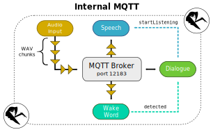
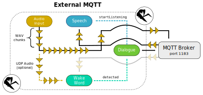

# Services

Rhasspy is composed of independent services that communicate over [MQTT](https://mqtt.org) using a superset of the [Hermes protocol](https://docs.snips.ai/reference/hermes) for these components:

* [Web Server](#web-server)
* [Dialogue Manager](#dialogue-manager)
* [Audio Input](#audio-input)
* [Wake Word Detection](#wake-word-detection)
* [Speech to Text](#speech-to-text)
* [Intent Recognition](#intent-recognition)
* [Intent Handling](#intent-handling)
* [Text to Speech](#text-to-speech)
* [Audio Output](#audio-output)

The [`rhasspy-supervisor`](#rhasspy-supervisor) tool converts your [profile](profiles.md) into a runnable configuration for either [supervisord](http://supervisord.org) or [docker-compose](https://docs.docker.com/compose/).

Each service sends and receives a specific set of MQTT messages. Message payloads are typically [JSON objects](https://json.org), except for the following messages whose payloads are binary [WAV audio](https://en.wikipedia.org/wiki/WAV):

* [`hermes/audioServer/<siteId>/audioFrame`](reference.md#audioserver_audioframe)
    * WAV chunk from microphone
* [`hermes/audioServer/<siteId>/playBytes/<requestId>`](reference.md#audioserver_playbytes) 
    * WAV audio to play through speakers
* [`rhasspy/asr/<siteId>/<sessionId>/audioCaptured`](reference.md#asr_audiocaptured) 
    * WAV audio recorded from session

Most messages contain a string `siteId` property, whose default value is "default". Each service takes one or more `--siteId <NAME>` arguments that determine which site IDs the service will listen for. If not specified, the service will listen for **all sites**.

---

## Internal vs. External MQTT

Rhasspy operates in one of two MQTT modes: internal or external. If you want to interact with Rhasspy over MQTT or use a [server with satellites](tutorials.md#server-with-satellites), it's important to understand the difference.

### Internal MQTT

When Rhasspy is configured for internal MQTT (the default), a [`mosquitto`](https://mosquitto.org/) broker is automatically started on port 12183 (override with `--local-mqtt-port`). All of Rhasspy's services will connect to this private broker and send messages through it.

If you're running Rhasspy inside [Docker](installation.md#docker), make sure to add `-p 12183:12183` to expose this port. Any downstream MQTT tools, like `mosquitto_pub` or `NodeRED` will need to have the MQTT port changed to 12183.

### External MQTT

If you have your own MQTT broker that you'd like Rhasspy to share, configure it for external MQTT mode. In this mode, Rhasspy will simply connect all of its services to your broker.

Streaming audio from your [microphone](audio-input.md) can sometimes cause congestion in an MQTT broker shared by many different services. For these scenarios, it's recommended to enable [UDP audio streaming](tutorials.md#udp-audio-streaming) for **both** the Rhasspy audio input service and wake word service. This will disable MQTT audio streaming until the wake word has been detected, and again after a voice command has been spoken.

---

## Web Server

Provides a [graphical web interface](usage.md#web-interface) for managing Rhasspy, and handles downloading language-specific profile artifacts.

### Available Services

* [rhasspy-server-hermes](https://github.com/rhasspy/rhasspy-server-hermes)
    * [alpine.js](https://github.com/alpinejs/alpine/) based web UI at `http://YOUR_SERVER:12101`
    * Implements Rhasspy's [HTTP API](reference.md#http-api) and [websocket API](reference.md#websocket-api)

## Dialogue Manager

Manages sessions initiated by a wake word [`detection`](reference.md#hotword_detected) or a [`startSession`](reference.md#dialoguemanager_startsession).

### Available Services

* [rhasspy-dialogue-hermes](https://github.com/rhasspy/rhasspy-dialogue-hermes)

### Input Messages

* [`hermes/dialogueManager/startSession`](reference.md#dialoguemanager_startsession) 
    * Start a new session
* [`hermes/dialogueManager/continueSession`](reference.md#dialoguemanager_continuesession)
    * Continue an existing session
* [`hermes/dialogueManager/endSession`](reference.md#dialoguemanager_endsession) 
    * End an existing session

### Output Messages

* [`hermes/dialogueManager/sessionStarted`](reference.md#dialoguemanager_sessionstarted)
    * New session has started
* [`hermes/dialogueManager/sessionQueued`](reference.md#dialoguemanager_sessionqueued)
    * New session has be enqueued
* [`hermes/dialogueManager/sessionEnded`](reference.md#dialoguemanager_sessionended)
    * Existing session has terminated
* [`hermes/dialogueManager/intentNotRecognized`](reference.md#dialoguemanager_intentnotrecognized)
    * Voice command was not recognized in existing session

## Audio Input

Records audio from a microphone and streams it as WAV chunks over MQTT. See [Audio Input](audio-input.md) for details.

### Available Services

* [rhasspy-microphone-cli-hermes](https://github.com/rhasspy/rhasspy-microphone-cli-hermes)
    * Calls an external program for audio input
    * Implements [arecord](audio-input.md#alsa) and [command](audio-input.md#command)
* [rhasspy-microphone-pyaudio-hermes](https://github.com/rhasspy/rhasspy-microphone-pyaudio-hermes)
    * Records directly from a [PyAudio](https://people.csail.mit.edu/hubert/pyaudio/) device
    * Implements [pyaudio](audio-input.md#pyaudio)

### Input Messages

* [`rhasspy/audioServer/getDevices`](reference.md#audioserver_getdevices)
    * Requests available input devices

### Output Messages

* [`hermes/audioServer/<siteId>/audioFrame`](reference.md#audioserver_audioframe)
    * WAV chunk from microphone
* [`rhasspy/audioServer/devices`](reference.md#audioserver_devices)
    * Description of available audio input devices

## Wake Word Detection

Listens to WAV chunks and tries to detect a wake/hotword. See [Wake Word](wake-word.md) for details.

### Available Services

* [rhasspy-wake-raven-hermes](https://github.com/rhasspy/rhasspy-wake-raven-hermes)
    * Implements [raven](wake-word.md#raven)
* [rhasspy-wake-pocketsphinx-hermes](https://github.com/rhasspy/rhasspy-wake-pocketsphinx-hermes)
    * Implements [pocketsphinx](wake-word.md#pocketsphinx)
* [rhasspy-wake-porcupine-hermes](https://github.com/rhasspy/rhasspy-wake-porcupine-hermes)
    * Implements [porcupine](wake-word.md#porcupine)
* [rhasspy-wake-precise-hermes](https://github.com/rhasspy/rhasspy-wake-precise-hermes)
    * Implements [precise](wake-word.md#mycroft-precise)
* [rhasspy-wake-snowboy-hermes](https://github.com/rhasspy/rhasspy-wake-snowboy-hermes)
    * Implements [snowboy](wake-word.md#snowboy)

### Input Messages

* [`hermes/hotword/toggleOn`](reference.md#hotword_toggleon)
    * Enables wake word detection
* [`hermes/hotword/toggleOff`](reference.md#hotword_toggleoff)
    * Disables wake word detection
* [`rhasspy/hotword/getHotwords`](reference.md#hotword_gethotwords)
    * Request available hotwords

### Output Messages

 * [`hermes/wake/hotword/<wakewordId>/detected`](reference.md#hotword_detected)
    * Wake word successfully detected
* [`rhasspy/hotword/hotwords`](reference.md#hotword_hotwords)
    * Description of available hotwords
 * [`hermes/error/hotword`](reference.md#hotword_error)
    * Wake word system error

## Speech to Text

Listens to WAV chunks and transcribes voice commands. See [Speech to Text](speech-to-text.md) for details.

### Available Services

* [rhasspy-asr-kaldi-hermes](https://github.com/rhasspy/rhasspy-asr-kaldi-hermes)
    * Implements [kaldi](speech-to-text.md#kaldi)
* [rhasspy-asr-pocketsphinx-hermes](https://github.com/rhasspy/rhasspy-asr-pocketsphinx-hermes)
    * Implements [pocketsphinx](speech-to-text.md#pocketsphinx)
* [rhasspy-asr-deepspeech-hermes](https://github.com/rhasspy/rhasspy-asr-deepspeech-hermes)
    * Implements [deepspeech](speech-to-text.md#deepspeech)
* [rhasspy-remote-http-hermes](https://github.com/rhasspy/rhasspy-remote-http-hermes)
    * POSTs to [remote web server](reference.md#api_speech_to_text) for speech recognition
    * Implements [remote](speech-to-text.md#remote-http-server) (`--asr-url`) and [command](speech-to-text.md#command) (`--asr-command`)

### Input Messages

* [`hermes/audioServer/<siteId>/audioFrame`](reference.md#audioserver_audioframe)
    * WAV chunk from microphone for a site
* [`hermes/audioServer/<siteId>/<sessionId>/audioSessionFrame`](reference.md#audioserver_audiosessionframe)
    * WAV chunk from microphone for a session
* [`hermes/asr/toggleOn`](reference.md#asr_toggleon)
    * Enable ASR system
* [`hermes/asr/toggleOff`](reference.md#asr_toggleoff)
    * Disable ASR system
* [`hermes/asr/startListening`](reference.md#asr_startlistening)
    * Start recording a voice command
* [`hermes/asr/stopListening`](reference.md#asr_stoplistening)
    * Stop recording a voice command
* [`rhasspy/asr/<siteId>/train`](reference.md#asr_train)
    * Re-train ASR system
* [`rhasspy/g2p/pronounce`](reference.md#g2p_pronounce)
    * Get phonetic pronunciations for words

### Output Messages

* [`hermes/asr/textCaptured`](reference.md#asr_textcaptured)
    * Successful voice command transcription
* [`hermes/error/asr`](reference.md#error_asr)
    * Error during transcription/training
* [`rhasspy/asr/<siteId>/trainSuccess`](reference.md#asr_trainsuccess)
    * ASR training succeeded
* [`rhasspy/asr/<siteId>/<sessionId>/audioCaptured`](reference.md#asr_audiocaptured)
    * Audio recorded from voice command
    * Sent when `sendAudioCaptured = true` in [`startListening`](reference.md#asr_audiocaptured)
* [`rhasspy/g2p/phonemes`](reference.md#g2p_phonemes)
    * Phonetic pronunciations of words

## Intent Recognition

Recognizes user intents from text input. See [Intent Recognition](intent-recognition.md) for details.

### Available Services

* [rhasspy-fuzzywuzzy-hermes](https://github.com/rhasspy/rhasspy-fuzzywuzzy-hermes)
    * Implements [fuzzywuzzy](intent-recognition.md#fuzzywuzzy)
* [rhasspy-nlu-hermes](https://github.com/rhasspy/rhasspy-nlu-hermes)
    * Implements [fsticuffs](intent-recognition.md#fsticuffs)
* [rhasspy-rasa-nlu-hermes](https://github.com/rhasspy/rhasspy-rasa-nlu-hermes)
    * Implements [rasa](intent-recognition.md#rasanlu)
* [rhasspy-remote-http-hermes](https://github.com/rhasspy/rhasspy-remote-http-hermes)
    * POSTs to [remote web server](reference.md#api_text_to_intent) for intent recognition
    * Implements [remote](intent-recognition.md#remote-http-server) (`--intent-url`) and [command](intent-recognition.md#command) (`--nlu-command`)

### Input Messages

* [`hermes/nlu/query`](reference.md#nlu_query)
    * Recognize intent from text
* [`rhasspy/nlu/<siteId>/train`](reference.md#nlu_<siteid>/train)
    * Retrain NLU system

### Output Messages

* [`hermes/intent/<intentName>`](reference.md#nlu_intent)
    * Intent successfully recognized
* [`hermes/nlu/intentNotRecognized`](reference.md#nlu_intentnotrecognized)
    * Intent was **not** recognized
* [`hermes/error/nlu`](reference.md#error_nlu)
    * Error during recognition/training
* [`rhasspy/nlu/<siteId>/trainSuccess`](reference.md#nlu_trainsuccess)
    * NLU training succeeded

## Intent Handling

Dispatches recognized intents to home automation software. See [Intent Handling](intent-handling.md) for details.

### Available Services

* [rhasspy-homeassistant-hermes](https://github.com/rhasspy/rhasspy-homeassistant-hermes)
    * Implements [homeassistant](intent-handling.md#home-assistant)
* [rhasspy-remote-http-hermes](https://github.com/rhasspy/rhasspy-remote-http-hermes)
    * POSTs to [remote web server](reference.md#api_handle_intent) for intent handling
    * Implements [remote](intent-handling.md#remote-server) (`--handle-url`) and [command](intent-handling.md#command) (`--handle-command`)

### Input Messages

* [`hermes/nlu/intent/<intentName>`](reference.md#nlu_intent)
    * Intent successfully recognized
* [`hermes/handle/toggleOn`](reference.md#handle_toggleon)
    * Enable intent handling
* [`hermes/handle/toggleOff`](reference.md#handle_toggleoff)
    * Disable intent handling

### Output Messages

* [`hermes/tts/say`](reference.md#tts_say)
    * Speak a sentence

## Text to Speech

Generates spoken audio for a sentence. See [Text to Speech](text-to-speech.md) for details.

### Available Services

* [rhasspy-tts-cli-hermes](https://github.com/rhasspy/rhasspy-tts-cli-hermes)
    * Calls external program for text to speech
    * Implements [espeak](text-to-speech.md#espeak), [flite](text-to-speech.md#flite), [picoTTS](text-to-speech.md#picotts), [nanoTTS](text-to-speech.md#nanotts), [marytts](text-to-speech.md#marytts), [opentts](text-to-speech.md#opentts), and [command](text-to-speech.md#command)
* [rhasspy-tts-larynx-hermes](https://github.com/rhasspy/rhasspy-tts-larynx-hermes)
    * Uses [Larynx](https://github.com/rhasspy/larynx) text to speech system (based on [MozillaTTS](https://github.com/mozilla/TTS))
    * Implements [larynx](text-to-speech.md#larynx)
* [rhasspy-tts-wavenet-hermes](https://github.com/rhasspy/rhasspy-tts-wavenet-hermes)
    * Uses Google's [WaveNet](https://cloud.google.com/text-to-speech/docs/wavenet)
    * Implements [wavenet](text-to-speech.md#google-wavenet)
* [rhasspy-remote-http-hermes](https://github.com/rhasspy/rhasspy-remote-http-hermes)
    * POSTs to [remote web server](reference.md#api_text_to_speech) for text to speech
    * Implements [remote](text-to-speech.md#remote) (`--tts-url`) and [command](text-to-speech.md#command) (`--tts-command`)

### Input Messages

* [`hermes/tts/say`](reference.md#tts_say)
    * Speak a sentence
* [`rhasspy/tts/getVoices`](reference.md#tts_getvoices)
    * Request available voices

### Output Messages

* [`hermes/tts/sayFinished`](reference.md#tts_sayfinished)
    * Finished *generating* audio (actually spoken with [`playBytes`](reference.md#audioserver_playbytes))
* [`rhasspy/tts/voices`](reference.md#tts_voices)
    * Description of available voices

## Audio Output

Plays WAV audio through an audio output device (speakers). See [Audio Output](audio-output.md) for details.

### Available Services

* [rhasspy-speakers-cli-hermes](https://github.com/rhasspy/rhasspy-speakers-cli-hermes)
    * Implements [remote](audio-output.md#remote) and [command](audio-output.md#command)
    * POSTs to [remote web server](reference.md#api_play_wav) for audio output

### Input Messages

* [`hermes/audioServer/<siteId>/playBytes/<requestId>`](reference.md#audioserver_playbytes)
    * WAV audio to play through speakers
* [`hermes/audioServer/toggleOff`](reference.md#audioserver_toggleoff)
    * Disable audio output
* [`hermes/audioServer/toggleOn`](reference.md#audioserver_toggleon)
    * Enable audio output
* [`rhasspy/audioServer/getDevices`](reference.md#audioserver_getdevices)
    * Request audio output devices

### Output Messages

* [`hermes/audioServer/<siteId>/playFinished`](reference.md#audioserver_playfinished)
    * Audio has finished playing
* [`rhasspy/audioServer/devices`](reference.md#audioserver_devices)
    * Details of audio output devices

## Rhasspy Supervisor

The [`rhasspy-supervisor`](https://github.com/rhasspy/rhasspy-supervisor) tool transforms a Rhasspy [`profile.json`](profiles.md) file into:

* A `supervisord.conf` file that can be run with [`supervisord`](http://supervisord.org)
    * Runs services on the local machine
    * Requires you to have service executables in your `PATH` (e.g., `rhasspy-server-hermes`)
* A `docker-compose.yml` file that can be run with [`docker-compose`](https://docs.docker.com/compose/)
    * Runs services inside a virtual Docker network
    * Requires [Docker](https://docs.docker.com/install/) and [docker-compose](https://docs.docker.com/compose/install/) to be installed
    
When you start Rhasspy, it automatically runs `rhasspy-supervisor` to generate these files in your profile directory. From there, it depends on how you've [installed Rhasspy](installation.md).

### Supervisord Restart

When running Rhasspy using [`supervisord`](http://supervisord.org), the process ID (PID) of the `supervisord` process will be written to a file named `supervisord.pid` in your profile directory. If a restart is requested from the web interface, a `SIGHUP` is sent to this PID, causing `supervisord` to re-read its configuration file and stop/start all child processes.

### Docker Compose Restart

If you run Rhasspy using [`docker-compose`](https://docs.docker.com/compose/), the restart process is a bit more complicated than with `supervisord`. This is due to the need to re-write `docker-compose.yml` on a profile change and bring the entire Docker container stack down and back up again.

A wrapper script like [`get-rhasspy.sh`](https://github.com/rhasspy/rhasspy-voltron/blob/master/get-rhasspy.sh) needs to monitor the profile directory for a file named `.restart_docker`. When a restart is requested via the web interface, this file is written and a timeout is set. The wrapper script should restart `docker-compose` (using `down` and then `up`), and then delete the `.restart_docker` file. Once its deleted, the web interface will reload the user's page.
