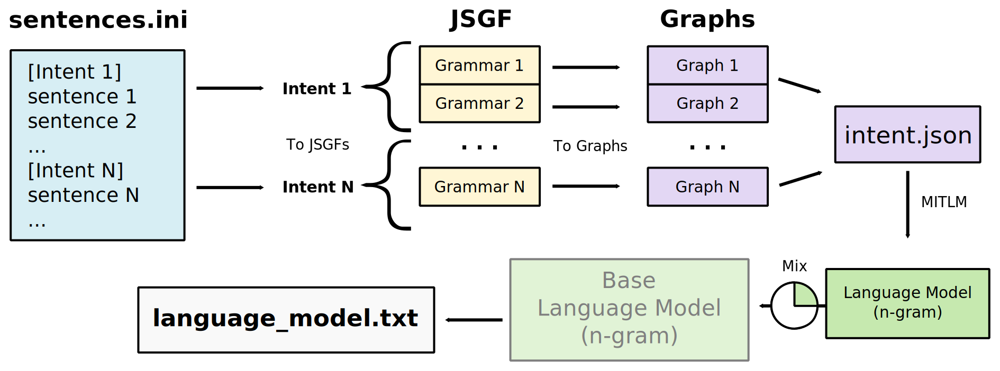

# Training

Rhasspy is designed to recognize voice commands [in a template language](#sentencesini). These commands are categorized by **intent**, and may contain [slots](#slots-lists) or [named entities](#tags), such as the color and name of a light.

* Intent Recognition
    * [Basic Syntax](#basic-syntax)
    * [Named Entities](#tags)
    * [Number Ranges](#number-ranges)
    * [Slots](#slots-lists)
        * [Slot Synonyms](#slot-synonyms)
        * [Slot Programs](#slot-programs)
    * [Converters](#converters)
* Speech Recognition
    * [Custom Words](#custom-words)
    * [Language Model Mixing](#language-model-mixing)

## sentences.ini

Voice commands stored in an [ini file](https://docs.python.org/3/library/configparser.html) whose "sections" are intents and "values" are sentence templates.

### Basic Syntax

To get started, simply list your intents (surround by brackets) and the possible ways of invoking them below:

```
[TestIntent1]
this is a sentence
this is another sentence for the same intent

[TestIntent2]
this is a sentence for a different intent
```

If you say "this is a sentence" after hitting the `Train` button, it will generate a `TestIntent1`.

### Groups

You can group multiple words together using `(parentheses)` like:

```
turn on the (living room lamp)
```

Groups (sometimes called sequences) can be [tagged](#tags) and [substituted](#substitutions) like single words. They may also contain [alternatives](#alternatives).

### Optional Words

Within a sentence template, you can specify optional word(s) by surrounding them `[with brackets]`. For example:

```
[an] example sentence [with] some optional words
```

will match:

* `an example sentence with some optional words`
* `example sentence with some optional words`
* `an example sentence some optional words`
* `example sentence some optional words`

### Alternatives

A set of items where only one is matched at a time is `(specified | like | this)`. For N items, there will be N matched sentences (unless you nest optional words, etc.). The template:

```
set the light to (red | green | blue)
```

will match:

* `set the light to red`
* `set the light to green`
* `set the light to blue`

### Tags

Named entities are marked in your sentence templates with `{tags}`. The name of the `{entity}` is between the curly braces, while the `(value of the){entity}` comes immediately before:

```
[SetLightColor]
set the light to (red | green | blue){color}
```

With the `{color}` tag attached to `(red | green | blue)`, Rhasspy will match:

* `set the light to [red](color)`
* `set the light to [green](color)`
* `set the light to [blue](color)`

When the `SetLightColor` intent is recognized, the JSON event will contain a `color` property whose value is either "red", "green" or "blue".

#### Tag Synonyms

Tag/named entity values can be (substituted](#substitutions) using the colon (`:`) inside the `{curly:braces}` like:

```
turn on the (living room lamp){name:light_1}
```

Now the `name` property of the intent JSON event will contain "light_1" instead of "living room lamp".

### Substitutions

The colon (`:`) is used to put something different than what's spoken into the recognized intent JSON. The left-hand side of the `:` is what Rhasspy expects to hear, while the right-hand side is what gets put into the intent:

```
turn on the (living room lamp):light_1
```

In this example, the spoken phrase "living room lamp" will be replaced by "light_1" in the recognized intent. Substitutions work for single words, [groups](#groups), [alternatives](#alternatives), and [tags](#tags):

```
turn on the living room lamp:light
(turn | switch):switch on the living room lamp
turn (on){action:activate} the living room lamp
```

See [tag synonyms](#tag-synonyms) for more details on tag substitution.

You can leave the left-hand or right-hand side (or both!) of the `:` empty:

```
these: words: will: be: dropped:
:these :will :be :added
```

When the right-hand side is empty (`dropped:`), the spoken word will not appear in the intent. An empty left-hand side (`:added`) means the word is *not* spoken, but will appear in the intent.

Leaving **both** sides empty does nothing unless you attach a [tag](#tags) it. This allows you to embed a named entity in a voice command without matching specific words:

```
turn on the living room lamp (:){domain:light}
```

An intent from the example above will contain a `domain` entity whose value is `light`.

### Rules

Rules allow you to reuse parts of your sentence templates. They're defined by `rule_name = ...` alongside other sentences and referenced by `<rule_name>`. For example:

```
colors = (red | green | blue)
set the light to <colors>
```

which is equivalent to:

```
set the light to (red | green | blue)
```

You can **share rules** across intents by referencing them as `<IntentName.rule_name>` like:

    [SetLightColor]
    colors = (red | green | blue)
    set the light to <colors>

    [GetLightColor]
    is the light <SetLightColor.colors>

The second intent (`GetLightColor`) references the `colors` rule from `SetLightColor`. Rule references without a dot must exist in the current intent.

### Number Ranges

Rhasspy supports using number literals (`75`) and number ranges (`1..10`) directly in your sentence templates. During training, the [num2words](https://pypi.org/project/num2words) package is used to generate words that the speech recognizer can handle ("seventy five"). For example:

```
[SetBrightness]
set brightness to (0..100){brightness}
```

The `brightness` property of the recognized `SetBrightness` intent will automatically be [converted](#converters) to an integer for you. You can optionally add a step to the integer range:

```
evens = 0..100,2
odds = 1..100,2
```

Under the hood, number ranges are actually references to the `rhasspy/number` [slot program](#slot-programs). You can override this behavior by creating your `slot_programs/rhasspy/number` program or disable it entirely by setting `intent.replace_numbers` to `false` in [your profile](profiles.md).

### Slots Lists

Large [alternatives](#alternatives) can become unwieldy quickly. For example, say you have a list of movie names:

```
movies = ("Primer" | "Moon" | "Chronicle" | "Timecrimes" | "Mulholland Drive" | ... )
```

Rather than keep this list in `sentences.ini`, you may put each movie name on a separate line in a file named `slots/movies` (no file extension) and reference it as `$movies`. Rhasspy automatically loads all files in the `slots` directory of your [profile](#profiles.md) and makes them available as slots lists.

For the example above, the file `slots/movies` should contain:

```
Primer
Moon
Chronicle
Timecrimes
Mullholand Drive
```

Now you can simply use the placeholder `$movies` in your sentence templates:

```
[PlayMovie]
play ($movies){movie_name}
```

When matched, the `PlayMovie` intent JSON will contain `movie_name` property with either "Primer", "Moon", etc.

Make sure to **re-train** Rhasspy whenever you update your slot values!

#### Slot Directories

Slot files can be put in **sub-directories** under `slots`. A list in `slots/foo/bar` should be referenced in `sentences.ini` as `$foo/bar`.

#### Slot Synonyms

Slot values are themselves sentence templates! So you can use all of the familiar syntax from above. Slot "synonyms" can be created simply using [substitutions](#substitutions). So a file named `slots/rooms` may contain:

```
[the:] (den | playroom | downstairs):den
```

which is referenced by `$rooms` and will match:

* the den
* den
* the playroom
* playroom
* the downstairs
* downstairs

This will always output just "den" because `[the:]` optionally matches "the" and then drops the word.

#### Slot Programs

Slot lists are great if your slot values always stay the same and are easily written out by hand. If you have slot values that you need to be generated *each time Rhasspy is trained*, you can use slot programs.

Create a directory named `slot_programs` in your profile (e.g., `$HOME/.config/rhasspy/profiles/en/slot_programs`):

```bash
slot_programs="${HOME}/.config/rhasspy/profiles/en/slot_programs"
mkdir -p "${slot_programs}"
```

Add a file in `slot_programs` with the name of your slot, e.g. `colors`. Write a program in this file, such as a bash script. Make sure to include the [shebang](https://en.wikipedia.org/wiki/Shebang_(Unix)) and mark the file as executable:

```bash
cat <<EOF > "${slot_programs}/colors"
#!/usr/bin/env bash
echo 'red'
echo 'green'
echo 'blue'
EOF

chmod +x "${slot_programs}/colors"
```

Now, when you reference `$colors` in your `sentences.ini`, Rhasspy will run the program you wrote and collect the slot values from each line. Note that you can output all the same things as regular [slots lists](#slots-lists), including optional words, alternatives, etc.

You can pass **arguments** to your program using the syntax `$name,arg1,arg2,...` in `sentences.ini` (no spaces). Arguments will be pass on the command-line, so `arg1` and `arg2` will be `$1` and `$2` in a bash script. 

Like regular slots lists, slot programs can also be put in sub-directories under `slot_programs`. A program in `slot_programs/foo/bar` should be referenced in `sentences.ini` as `$foo/bar`.

#### Built-in Slots

Rhasspy includes a few built-in slots for each language:

* `$rhasspy/days` - day names of the week
* `$rhasspy/months` - month names of the year

### Converters

By default, all named entity values in a recognized intent's JSON are strings. If you need a different data type, such as an integer or float, or want to do some kind of complex *conversion*, use a converter:

```
[SetBrightness]
set brightness to (low:0 | medium:0.5 | high:1){brightness!float}
```

The `!name` syntax calls a converter by name. Rhasspy includes several built-in converters:

* int - convert to integer
* float - convert to real
* bool - convert to boolean
* lower - lower-case
* upper - upper-case

You can define your own converters by placing a file in the `converters` directory of your profile. Like [slot programs](#slot-programs), this file should contain a [shebang](https://en.wikipedia.org/wiki/Shebang_(Unix)) and be marked as executable (`chmod +x`). A file named `converters/foo/bar` should be referenced as `!foo/bar` in `sentences.ini`.

Your custom converter will receive the value to convert on standard in (`stdin`) encoded as JSON. You should print a converted JSON value to standard out `stdout`. The example below demonstrates converting a string value into an integer:

```python
#!/usr/bin/env python3
import sys
import json

value = json.load(sys.stdin)
print(int(value))
```

Converters can be *chained*, so `!foo!bar` will call the `foo` converter and then pass the result to `bar`.

### Special Cases

If one of your sentences happens to start with an optional word (e.g., `[the]`), this can lead to a problem:

    [SomeIntent]
    [the] problem sentence

Python's [configparser](https://docs.python.org/3/library/configparser.html) will interpret `[the]` as a new section header, which will produce a new intent, grammar, etc. Rhasspy handles this special case by using a backslash escape sequence (`\[`):

    [SomeIntent]
    \[the] problem sentence

Now `[the]` will be properly interpreted as a sentence under `[SomeIntent]`. You only need to escape a `[` if it's the **very first** character in your sentence.

### Motivation

The combination of an ini file and JSGF is arguably an abuse of two file formats, so why do this? At a minimum, Rhasspy needs a set of sentences grouped by intent in order to train the speech and intent recognizers. A fairly pleasant way to express this in text is as follows:

    [Intent 1]
    sentence 1
    sentence 2
    ...

    [Intent 2]
    sentence 3
    sentence 4
    ...

Compared to JSON, YAML, etc., there is minimal syntactic overhead for the purposes of just writing down sentences. However, its shortcomings become painfully obvious once you have more than a handful of sentences and intents:

1. If two sentences are nearly identical, save for an *optional word* like "the" or "a", you have to maintain two nearly identical copies of a sentence.
2. When speaking about collections of things, like colors or states (on/off), you need a sentence for every *alternative choice*.
3. You cannot share commonly *repeated phrases* across sentences or intents.
4. There is no way to *tag phrases* so the intent recognizer knows the values for an intent's slots (e.g., color).

Each of these shortcomings are addressed by considering the space between intent headings (`[Intent 1]`, etc.) as a **grammar** that represent many possible voice commands. The possible sentences, stripped of their tags, are used as input to [opengrm](https://www.opengrm.org) to produce a standard ARPA language model for [pocketsphinx](https://github.com/cmusphinx/pocketsphinx) or [Kaldi](https://kaldi-asr.org). The tagged sentences are then used to train an intent recognizer.

## Custom Words

Rhasspy looks for words you've defined outside of your profile's base dictionary (typically `base_dictionary.txt`) in a custom words file (typically `custom_words.txt`). This is just a [CMU phonetic dictionary](https://cmusphinx.github.io/wiki/tutorialdict/) with words/pronunciations separated by newlines:

    hello H EH L OW
    world W ER L D

You can use the [Words tab](usage.md#words-tab) in Rhasspy's web interface to generate this dictionary. During training, Rhasspy will merge `custom_words.txt` into your `dictionary.txt` file so the [speech to text](speech-to-text.md) system knows the words in your voice commands are pronounced.

## Language Model Mixing

Rhasspy is designed to only respond to the voice commands you specify in [sentences.ini](training.md#sentencesini), but both the Pocketsphinx and Kaldi speech to text systems are capable of transcribing open ended speech. While this will never be as good as a cloud-based system, Rhasspy [offers it as an option](speech-to-text.md#open-transcription).

A middle ground between open transcription and custom voice commands is **language model mixing**. During training, Rhasspy can mix a (large) pre-built language model with the custom-generated one. You specify a **mixture weight** (0-1), which controls how much of an influence the large language model has; a mixture weight of 0 makes Rhasspy sensitive *only* to your voice commands, which is the default.



To see the effect of language model mixing, consider a simple `sentences.ini` file:

```
[ChangeLightState]
turn (on){state} the living room lamp
```

This will only allow Rhasspy to understand the voice command "turn on the living room lamp". If we train Rhasspy and perform speech to text on a WAV file with this command, the output is no surprise:

```
$ rhasspy-cli --profile en train
OK

$ rhasspy-cli --profile en wav2text < turn_on_living_room_lamp.wav
turn on the living room lamp
```

Now let's do speech to text on a variation of the command, a WAV file with the speech "would you please turn on the living room lamp":

```
$ rhasspy-cli --profile en wav2text < would_you_please_turn_on_living_room_lamp.wav
on the the the turn on the living room lamp
```

The word salad here is because we're trying to recognize a voice command that was not present in `sentences.ini`. We could always add it, of course, and that is the preferred method for Rhasspy. There may be cases, however, where we cannot anticipate all of the variations of a voice command. For these cases, you should increase the `mix_weight` in your [profile](profiles.md) to something above 0:

```
$ rhasspy-cli --profile en \
    --set 'speech_to_text.pocketsphinx.mix_weight' '0.05' \
    train

OK
```

Note that training will take **significantly** longer because of the size of the base language model. Now, let's test our two WAV files:

```
$ rhasspy-cli --profile en wav2text < turn_on_living_room_lamp.wav
turn on the living room lamp

$ rhasspy-cli --profile en wav2text < would_you_please_turn_on_living_room_lamp.wav
would you please turn on the living room lamp
```

Great! Rhasspy was able to transcribe a sentence that it wasn't explicitly trained on. If you're trying this at home, you surely noticed that it takes a lot longer to process the WAV files too. In practice, it's not recommended to do mixed language modeling on lower-end hardware like a Raspberry Pi. If you need open ended speech recognition, try running Rhasspy in a [client/server set up](speech-to-text.md#remote-http-server).

### The Elephant in the Room

This isn't the end of the story for open ended speech recognition in Rhasspy, however, because Rhasspy also does *intent recognition* using the transcribed text as input. When the set of possible voice commands is known ahead of time, it's relatively easy to know what to do with each and every sentence. The flexibility gained from mixing in a base language model unfortunately places a large burden on the intent recognizer.

In our `ChangeLightState` example above, we're fortunate that everything works as expected:

```
$ echo 'would you please turn on the living room lamp' | \
    rhasspy-cli --profile en text2intent

{
    "would you please turn on the living room lamp": {
        "text": "turn on the living room lamp",
        "intent": {
            "name": "ChangeLightState",
            "confidence": 1.0
        },
        "entities": [
            {
                "entity": "state",
                "value": "on"
            }
        ],
        "slots": {
            "state": "on"
        }
    }
}
```

But this works only because the default intent recognizer ([fsticuffs](intent-recognition.md#fsticuffs)) ignores unknown words by default, so "would you please" is not interpreted. Changing "lamp" to "light" in the input sentence will reveal the problem:

```
$ echo 'would you please turn on the living room light | \
    rhasspy-cli --profile en text2intent

{
    "would you please turn on the living room light": {
        "text": "",
        "intent": {
            "name": "",
            "confidence": 0
        },
        "entities": [],
        "slots": {}
    }
}
```

This sentence would be impossible for the speech to text system to recognize without language model mixing, but it's quite possible now. We can band-aid over the problem a bit by switching to the [fuzzywuzzy](intent-recognition.md#fuzzywuzzy) intent recognizer:

```
$ rhasspy-cli --profile en \
    --set 'speech_to_text.pocketsphinx.mix_weight' '0.05' \
    --set 'intent.system' 'fuzzywuzzy' \
    train

OK
```

Now when we interpret the sentence with "light" instead of "lamp", we still get the expected output:

```
$ echo 'would you please turn on the living room light' | \
    rhasspy-cli --profile en --set 'intent.system' 'fuzzywuzzy' text2intent

{
    "would you please turn on the living room light": {
        "text": "turn on the living room lamp",
        "intent": {
            "name": "ChangeLightState",
            "confidence": 0.86
        },
        "entities": [
            {
                "entity": "state",
                "value": "on"
            }
        ],
        "slots": {
            "state": "on"
        }
    }
}
```

This works well for our toy example, but will not scale well when there are thousands of voice commands represented in `sentences.ini` or if the words used are significantly different than in the training set ("light" and "lamp" are close enough for `fuzzywuzzy`).

A machine learning-based intent recognizer, like [flair](intent-recognition.md#flair) or [Rasa](intent-recognition.md#rasanlu), would be a better choice for open ended speech.
