# Tutorials

* [Getting Started Guide](#getting-started-guide)
* [From Scratch on a Raspberry Pi](#from-scratch-on-a-raspberry-pi)
* [Server with Satellites](#server-with-satellites)
* [Custom Wakeword with Raven](#custom-wakeword-with-raven)

## Getting Started Guide

Welcome to Rhasspy! This guide will step you through setting up Rhasspy immediately after [installation](installation.md). This guide was tested with the following hardware and software:

* Raspberry Pi 3B+
* 32 GB SD card
* Raspbian Buster Lite
* Playstation Eye Microphone
* 3.5 mm speakers

When you first start Rhasspy and visit the [web interface](http://localhost:12101), you will see the [Test Page](usage.md#test-page) with a bar like this:


By default, Rhasspy does not start any services (highlighted in green on this bar). From left to right, these services are:

|                                                         | Service             | Description                                                                      |
| -----                                                   | -----               | -----                                                                            |
|               | MQTT                | Indicates if Rhasspy is connected to an internal or external MQTT broker (green) |
|   | Audio Input         | Records audio from a microphone                                                  |
|           | Intent Handle       | Sends recognized intents to other software                                       |
|               | Wake Word           | Listens to live audio and detects a hot/wake word                                |
|  | Speech Recognition  | Converts voice commands into text                                                |
|  | Intent Recognition  | Recognizes intents and slots from text                                           |
|      | Text to Speech      | Speaks text through audio output system                                          |
|          | Audio Output        | Plays audio through a speaker                                                    |
|       | Dialogue Management | Coordinates wake/speech/intent systems and external skills                       |

Clicking on an individual icon on the service bar will take you to its settings. You can also choose "Settings" from the dropdown menu at the top of the web page.

### Settings

In the [Settings Page](usage.md#settings-page), you can change which services Rhasspy will start and configure. Each section is initially red or disabled, indicating that no service will be started.

To have Rhasspy start a specific service, select an option from the drop down list next to a red (or green) button. When selected, a service's settings will be displayed when you click the button.

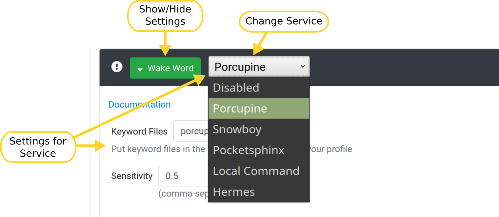

**NOTE**: Some settings, like the available microphones and speakers, require you to click "Save Settings" first because the service must be started!

To get started, enable the following services and click "Save Settings":

* Audio Recording (PyAudio)
* Speech to Text (Pocketsphinx)
* Intent Recognition (Fsticuffs)
* Text to Speech (Espeak)
* Audio Playing (aplay)
* Dialogue Management (Rhasspy)

Visually, your settings page should look like the following image:

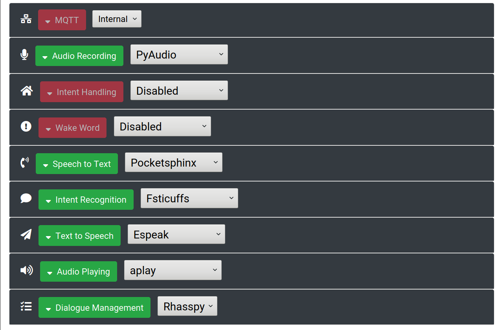

(Make sure you click "Save Settings" and wait for Rhasspy to restart)

### Download Profile

Once Rhasspy restarts, you will see a notification at top that tells you Rhasspy needs to download some files before continuing.


Click the "Download" button to begin downloading the necessary speech models, etc. from GitHub. You will see a dialogue box with the download progress of each file.

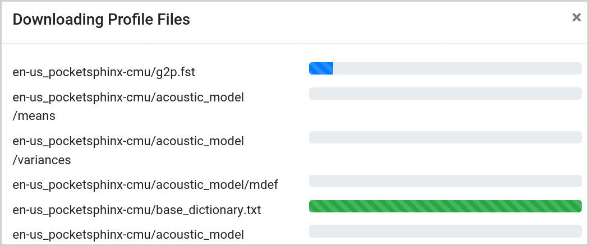

Once all files have finished downloading, Rhasspy will automatically restart.

### Test Microphone

Expand the "Audio Recording" section by clicking the green button. You should see a drop down list with available microphones. If you have trouble recording audio, try choosing a specific device instead of using the default (make sure to "Save Settings").

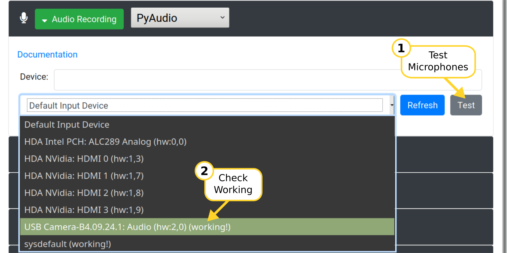

Clicking the blue "Refresh" button will query PyAudio again for this list. The "Test" button next to "Refresh" will attempt to record audio from each device and guess if it's working or not. The text "working!" will show up next to working microphones in the list.

### Training

Rhasspy needs to know all of the voice commands you plan to use, grouped by intent. On the "Sentences" page, you can enter these using Rhasspy's [voice command language](training.md#sentencesini).

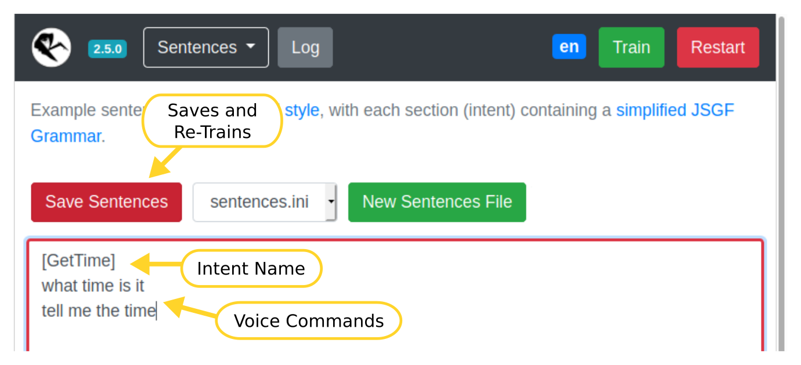

Clicking the "Save Sentences" button will save your voice commands and automatically re-train your profile.

For this guide, we'll be using Rhasspy's [default English voice commands](https://github.com/rhasspy/rhasspy-profile/blob/master/rhasspyprofile/profiles/en/sentences.ini).

### Testing

The "Testing" page lets you try out Rhasspy's speech recognition, natural language understanding, and text to speech capabilities.

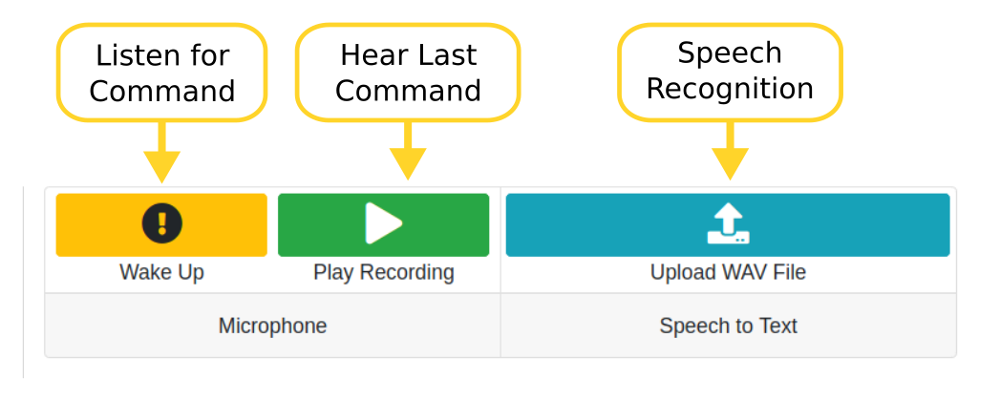

To get started, click the yellow "Wake Up" button. You should see a dialog box pop up that says "Listening for command".


Speak a voice command, like "turn on the living room lamp" and wait for a moment. If Rhasspy successfully recognized your command, it will display the transcription, intent name, and its slot values below.

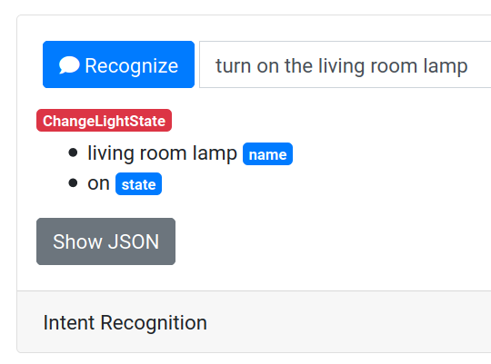

You can click the gray "Show JSON" button underneath to view the intent JSON you would receive if this voice command was recognized through the [`/api/speech-to-intent` HTTP endpoint](reference.md#api_speech_to_intent).

### Websocket

In this section, we'll create a [Node-RED](https://nodered.org/) flow that uses Rhasspy's [websocket API](reference.md#websocket-api) to receive recognized intents.

Before continuing, you'll need to [install Node-RED](https://nodered.org/docs/getting-started/) and create an empty flow. If you already have [Docker](https://www.docker.com/) installed, you can just run:

```bash
docker run -it -p 1880:1880 nodered/node-red
```

and then visit [http://localhost:1880](http://localhost:1880) to edit your first flow.

The easiest way to continue is to import a pre-built flow as JSON. Click the [hamburger button](https://en.wikipedia.org/wiki/Hamburger_button) in the upper right, select Import, then Clipboard.

Copy and paste the following JSON into the "Import nodes" text box and then click "Import":

```json
[{"id":"70d90eed.9fc7e8","type":"tab","label":"Rhasspy Intent","disabled":false,"info":""},{"id":"d7f94fdd.9b5028","type":"debug","z":"70d90eed.9fc7e8","name":"","active":true,"tosidebar":true,"console":false,"tostatus":false,"complete":"true","targetType":"full","x":230,"y":200,"wires":[]},{"id":"d60f2a3e.ec485","type":"websocket in","z":"70d90eed.9fc7e8","name":"","server":"","client":"be111083.116b5","x":200,"y":60,"wires":[["d7f94fdd.9b5028"]]},{"id":"be111083.116b5","type":"websocket-client","z":"","path":"ws://localhost:12101/api/events/intent","tls":"","wholemsg":"true"}]
```

If it imported successfully there will be a **new tab** labeled "Rhasspy Intent".

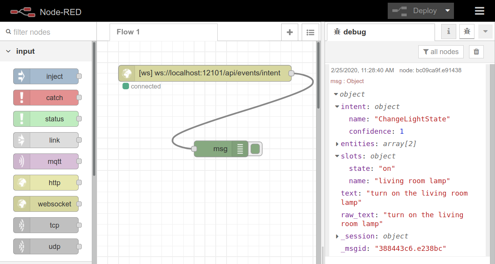

If you want to **manually** create the flow, follow these steps:

1. Drag a websocket input node onto the canvas and double-click it
2. Select "Connect to" in the Type field
3. Click the edit button (pencil) next to "Add new websocket-client..."
4. Enter `ws://localhost:12101/api/events/intent` for the URL (`wss` if using a [self-signed certificate](usage.md#secure-hosting-with-https))
5. Choose "entire message" in Send/Receive
6. Click the red "Add" button and then the "Done" button
7. Drag a debug output node onto the canvas
8. Double-click the debug node and choose "complete msg object"
9. Click the red "Done" button
10. Drag a line from the websocket node to the debug node

#### Catching Intents

To catch intents from Rhasspy, first click the red "Deploy" button in your Node-RED web interface. Next, select the "debug" tab on the right (a bug with a small "i" in it).

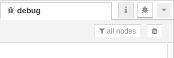

In Rhasspy's web interface, type a sentence into the "Intent Recognition" section of the "Test" page and click the "Recognize" button.

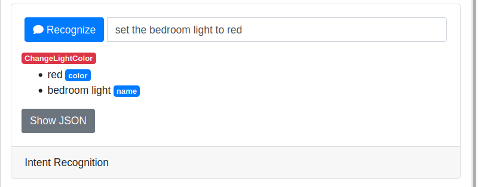

Back in the Node-RED web interface, you should see a JSON object in the debug tab that represents the recognized intent!

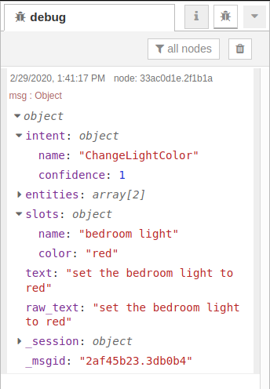

By looking at the `intent` and `slots` properties, you can take different actions in your flow depending on the intent and its named entities.

### Wake Word

You can also receive websocket events when Rhasspy wakes up. To test this, go to "Settings" in the Rhasspy web interface and select "Porcupine" for the Wake Word service. Click "Save Settings" and wait for Rhasspy to restart.

Next, import the following flow into Node-RED:

```json
[{"id":"70124295.5e68f4","type":"tab","label":"Rhasspy Wake","disabled":false,"info":""},{"id":"33ac0d1e.2f1b1a","type":"debug","z":"70124295.5e68f4","name":"","active":true,"tosidebar":true,"console":false,"tostatus":false,"complete":"true","targetType":"full","x":230,"y":200,"wires":[]},{"id":"d46737be.d4eb28","type":"websocket in","z":"70124295.5e68f4","name":"","server":"","client":"13bb27da.a15648","x":200,"y":80,"wires":[["33ac0d1e.2f1b1a"]]},{"id":"13bb27da.a15648","type":"websocket-client","z":"","path":"ws://localhost:12101/api/events/wake","tls":"","wholemsg":"true"}]
```

In the Node-RED web interface, select the "Rhasspy Wake" flow and the debug tab. If you speak the wake word now ("porcupine" by default), you should see a JSON object show up in Node-RED with some information about the wake word and site.

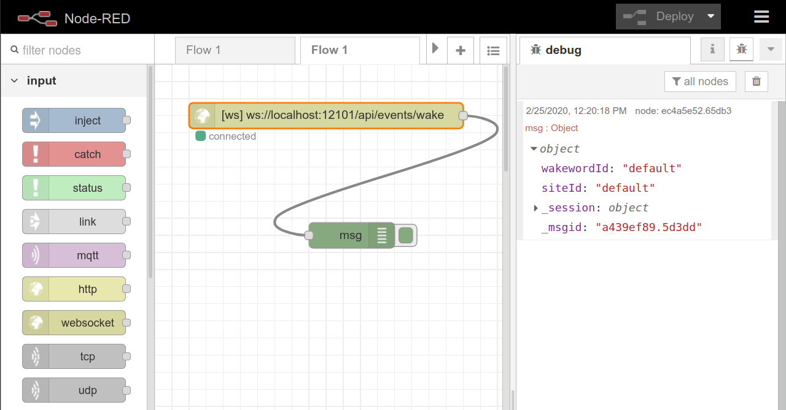

### Text to Speech

Rhasspy supports several [text to speech](text-to-speech.md) systems. You can use the [`/api/text-to-speech` HTTP endpoint](reference.md#api_text_to_speech) to make Rhasspy speak a sentence.

A simple Node-RED flow can do this using an inject node and an HTTP POST node. First, import the following flow:

```json
[{"id":"765ef360.6f2c2c","type":"tab","label":"Rhasspy Text to Speech","disabled":false,"info":""},{"id":"72e0cae1.8d7644","type":"http request","z":"765ef360.6f2c2c","name":"http://localhost:12101/api/text-to-speech","method":"POST","ret":"txt","paytoqs":false,"url":"http://localhost:12101/api/text-to-speech","tls":"","proxy":"","authType":"basic","x":260,"y":180,"wires":[[]]},{"id":"7ebdab96.406734","type":"inject","z":"765ef360.6f2c2c","name":"Welcome to the world of offline voice assistants.","topic":"","payload":"Welcome to the world of offline voice assistants.","payloadType":"str","repeat":"","crontab":"","once":false,"onceDelay":0.1,"x":220,"y":80,"wires":[["72e0cae1.8d7644"]]}]
```

Next, select the "Rhasspy Text to Speech" flow in Node-RED and click the square button on the inject node.

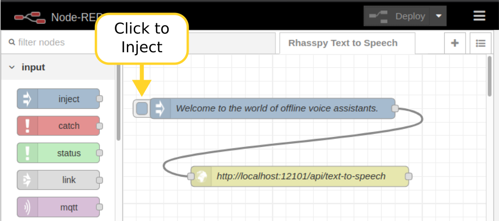

Rhasspy should say "welcome to the world of offline voice assistants" in robotic voice.

### Simple Skill

As a final demonstration, let's create a simple Rhasspy "skill" using Python. Rhasspy implements most of the [Hermes protocol](https://docs.snips.ai/reference/hermes) that powered [Snips.AI](https://snips.ai/), so some Snips.AI skills may be compatible without modification.

The first step to creating a skill is connect Rhasspy to an external MQTT broker. By default, Rhasspy will connect all of its services to an internal broker on port 12183 (usually running inside the Docker container).

If you don't have an existing MQTT broker (Home Assistant as [one built in](https://www.home-assistant.io/docs/mqtt/broker)), it's easy to get one up and running by installing [mosquitto](https://mosquitto.org/) on your system (e.g., `sudo apt-get install mosquitto`).

Once you have `mosquitto` running, go to the "Settings" page in the Rhasspy web interface and change the MQTT setting to "External". You may need to expand the MQTT section and modify the host/port if your broker is running on a different machine.

Once you click "Save Settings", Rhasspy will restart and try to connect to your MQTT broker. **This will fail** if you are running Rhasspy inside Docker and trying to connect to `localhost`! In this case, you **must** stop Rhasspy (with `docker stop`) and modify your `docker run` command like this:

```bash
docker run -d -p 12101:12101 \
    --network host \
    --restart unless-stopped \
    -v "$HOME/.config/rhasspy/profiles:/profiles" \
    --device /dev/snd:/dev/snd \
    rhasspy/rhasspy:2.5.0-pre \
    --user-profiles /profiles \
    --profile en
```

The addition of `--network host` will allow Rhasspy to connect to services running on your local machine (like `mosquitto`).

#### Python Skill Code

It's skill time! Save the following Python code to a file named `simple-skill.py`:

```python
import json

# pip install paho-mqtt
import paho.mqtt.client as mqtt


def on_connect(client, userdata, flags, rc):
    """Called when connected to MQTT broker."""
    client.subscribe("hermes/intent/#")
    client.subscribe("hermes/nlu/intentNotRecognized")
    print("Connected. Waiting for intents.")


def on_disconnect(client, userdata, flags, rc):
    """Called when disconnected from MQTT broker."""
    client.reconnect()


def on_message(client, userdata, msg):
    """Called each time a message is received on a subscribed topic."""
    nlu_payload = json.loads(msg.payload)
    if msg.topic == "hermes/nlu/intentNotRecognized":
        sentence = "Unrecognized command!"
        print("Recognition failure")
    else:
        # Intent
        print("Got intent:", nlu_payload["intent"]["intentName"])

        # Speak the text from the intent
        sentence = nlu_payload["input"]

    site_id = nlu_payload["siteId"]
    client.publish("hermes/tts/say", json.dumps({"text": sentence, "siteId": site_id}))


# Create MQTT client and connect to broker
client = mqtt.Client()
client.on_connect = on_connect
client.on_disconnect = on_disconnect
client.on_message = on_message

client.connect("localhost", 1883)
client.loop_forever()
```

You will need the [paho-mqtt Python library](https://pypi.org/project/paho-mqtt/), which is installed by running `pip install paho-mqtt` (it's highly recommended you do this in a [virtual environment](https://docs.python.org/3/tutorial/venv.html)).

Now, you can run the skill in a separate terminal using `python3 simple-skill.py`
You should see "Connected. Waiting for intents." printed to the terminal.

Try giving Rhasspy a voice command, either by saying the wake word or clicking the "Wake Up" button. For example, "turn on the living room lamp". You should see something like "Got intent: ChangeLightState" printed to the skill's terminal and hear Rhasspy repeat the words back to you!

If you give a command that Rhasspy doesn't recognize, this skill will speak the words "Unrecognized command". Try modifying the code and restarting the skill. Check out the [MQTT API reference](reference.md#mqtt-api) for details on MQTT topics and messages.

Happy Rhasspy-ing! &#x263A;

#### Blackbelt Bash Skill

Using Rhasspy's generic [`/api/mqtt`](reference.md#api_mqtt) HTTP endpoint, you can approximate the Python skill above with a tiny Bash script:

```bash
while true; do \
    curl -s 'localhost:12101/api/mqtt/hermes/intent/%23' | \
      jq .payload.input | \
      curl -s -X POST --data @- 'localhost:12101/api/text-to-speech'; \
done
```

This script loops indefinitely and waits for an MQTT message on `hermes/intent/#` (the `#` is encoded as `%23` in the URL). When a message is received, the "input" field of the payload is extracted with [`jq`](https://stedolan.github.io/jq) and then passed to Rhasspy's [`/api/text-to-speech`](reference.md#api_text_to_speech) HTTP endpoint.

---

## From Scratch on a Raspberry Pi

This guide will cover installing Rhasspy on a Raspberry Pi from scratch using [Docker](installation.md#docker). This guide will step you through setting up Rhasspy immediately after [installation](installation.md). This guide was tested with the following hardware and software:

* Raspberry Pi 3B+
* 32 GB SD card
* Raspberry Pi OS (32-bit) Lite
* ReSpeaker 2mic HAT
* 3.5 mm speakers

### Purchasing a Raspberry Pi

I highly recommend buying a [CanaKit Raspberry Pi kit](https://www.amazon.com/CanaKit-Raspberry-4GB-Starter-Kit/dp/B07V5JTMV9), which includes everything you need to get started. At a minimum you need a Pi, an SD card, a power supply, and a microphone. You'll probably want a speaker too, but it's optional.

Be careful when choosing a kit and a microphone. The [ReSpeaker 2mic HAT](https://respeaker.io/2_mic_array/) plugs into the GPIO pins on the Pi, which means you won't be able to easily enclose it in the kit's case or use the included fan.

### Setting up the SD Card

We will be installing Raspberry Pi OS Lite, a "headless" and lightweight version of the Raspberry Pi operating system. Without a GUI or desktop, you will need to SSH (remote access) into the Pi to complete the installation. We'll make sure to enable SSH and WiFi before booting the Pi for the first time.

On your desktop, start by downloading [Raspberry Pi OS (32-bit) Lite](https://www.raspberrypi.org/downloads/raspberry-pi-os/) (about 400 MB). If possible, please use the Torrent file and seed it for others. Once downloaded, I had a file named `2020-05-27-raspios-buster-lite-armhf.zip` that was 452.7 MB.

In order to "burn" the image to your Pi's SD card, you need to also download and install the [Raspberry Pi Imager](https://www.raspberrypi.org/downloads/). I downloaded the "Raspberry Pi Imager for Ubuntu", which was a file named `imager_amd64.deb`. This file can either be double-clicked to launch an installer or installed through the command line with:

```sh
$ sudo apt install ./imager_amd64.deb
```

Once installed, run the imager using your typical application launcher ("Start" menu) or by running `rpi-imager` on Linux.

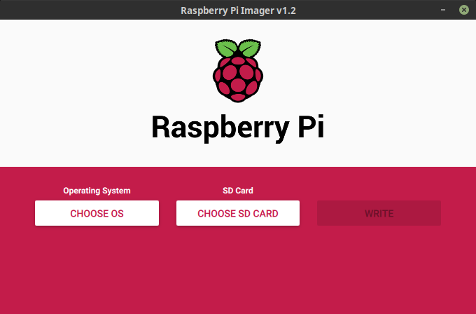

Insert your SD card into the SD card reader that came with your kit, and put in your desktop computer.


In the imager, click the "CHOOSE OS" button, **scroll to the bottom**, and click "Use custom".

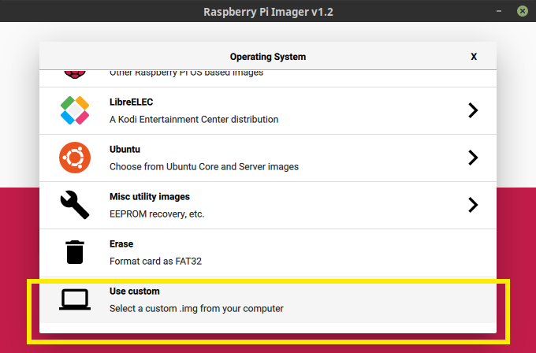

Browse to where you downloaded the Raspberry Pi OS image (a zip file, about 400 MB) and open it.

Next, click "CHOOSE SD CARD" and select your SD card. **Be careful not to pick an external drive you may have plugged in!**

Lastly, click the "WRITE" button and enter your admin password. It may take some time to finish, so be patient.

#### Enabling SSH and WiFi

After writing the Raspberry Pi OS to your SD card, browse the "boot" volume on your desktop computer. You may need to unplug and replug the SD card reader first. You should see a bunch of files that start with "bcm" and some others that start with "kernel".

Create a new, empty file in the top-level directory of the `boot` volume named `ssh` (lower case, no file extension). The presence of this file will tell the Raspberry Pi to enable SSH on boot.

To enable WiFi, create a file in the top-level directory of the `boot` volume named `wpa_supplicant.conf` edit it with a text editor. Paste in the following content (taken from [here](https://www.raspberrypi.org/documentation/configuration/wireless/headless.md)) and save the file:

```
ctrl_interface=DIR=/var/run/wpa_supplicant GROUP=netdev
update_config=1
country=<Insert 2 letter ISO 3166-1 country code here>

network={
 ssid="<Name of your wireless LAN>"
 psk="<Password for your wireless LAN>"
}
```

Using this list of [country codes](https://en.wikipedia.org/wiki/ISO_3166-1#Current_codes), mine looks like this:

```
ctrl_interface=DIR=/var/run/wpa_supplicant GROUP=netdev
update_config=1
country=US

network={
 ssid="MySuperCoolWiFi"
 psk="MySuperCoolPassword"
}
```

After saving the file, eject the SD card from your computer and insert it into the Pi. We're ready to boot!

### Booting the Pi for the First Time

Ensure that your microphone and SD card are inserted into your Raspberry Pi. If you have a spare HDMI monitor, I'd highly recommend plugging it in so you can get the Pi's IP address and see if there were any problems during boot.

Once everything is connected, go ahead and plug your power supply into the Pi. You should see some raspberry icons in the upper left and scrolling text as it boots. When it comes to the login prompt, read upwards until you find a line that says "My IP address is ..." (probably starts with 192.168). My Pi's IP address was 192.168.1.26, but yours is likely different.

From a terminal on your desktop computer, try pinging your Pi (where `<IP_ADDRESS>` is your Pi's IP address).

```sh
$ ping <IP_ADDRESS>
```

If you see something like `64 bytes from <IP_ADDRESS>: icmp_seq=1 ttl=64 time=50.0 ms` then all is well. Hit CTRL+C to stop pinging.

All of the next steps must be done on the Raspberry Pi itself. You can either connect a keyboard/monitor to the Pi or SSH in remotely. Login locally with the user name `pi` and the password `raspberry` (lower case). To SSH in remotely, execute the following command from a terminal on your desktop computer (where `<IP_ADDRESS>` is your Pi's IP address):

```sh
$ ssh pi@<IP_ADDRESS>
```

You will probably receive a message complaining that the "authenticity of host" cannot be established. Type "yes" and hit ENTER. The password is `raspberry` (lower case).

If you see a prompt like this, all is well:

```sh
pi@raspberrypi:~ $ 
```

### Installing Microphone Drivers

If you're using a [ReSpeaker mic array](https://respeaker.io/), you need to install the driver before continuing. If not, proceed to the [Installing Rhasspy](#installing-rhasspy) step.

We'll following the official instructions from the [seeed-voicecard GitHub page](https://github.com/respeaker/seeed-voicecard). On your Raspberry Pi, enter the following commands:

```sh
$ sudo apt-get update
$ sudo apt-get install --yes git
$ git clone https://github.com/respeaker/seeed-voicecard
$ cd seeed-voicecard
$ sudo ./install.sh
$ sudo reboot
```

This may take a long time to complete, and will reboot your Pi when finished. Once your Pi reboots, log in and check if your microphone is available:

```sh
$ arecord -L
```

If you see your microphone listed, installation was successful (something like `seeed2micvoicerec`). When configuring Rhasspy, set audio recording system to `arecord` and the device to `plughw:CARD=seeed2micvoicec,DEV=0`

### Installing Rhasspy

We will be using the [Docker](installation.md#docker) install method for Rhasspy, since its the simplest way to get started and keep updated for beginners.

On your Pi, enter the following command:

```sh
$ curl -sSL https://get.docker.com | sh
```

After Docker is installed, you'll need to add the `pi` user to the `docker` group:

```sh
$ sudo usermod -aG docker pi
```

and then reboot the Pi:

```sh
$ sudo reboot
```

After the Pi reboots, log into it again (either locally or via SSH) and pull the Rhasspy Docker image:

```sh
$ docker pull rhasspy/rhasspy
```

If you're running Rhasspy on a Raspberry Pi Zero, please follow [these instructions](http://localhost:8000/installation/#raspberry-pi-zero) instead.

After downloading and extracting the Rhasspy Docker image, start it running with this command:

```sh
$ docker run -it -p 12101:12101 \
      -v "$HOME/.config/rhasspy/profiles:/profiles" \
      -v "/etc/localtime:/etc/localtime:ro" \
      --device /dev/snd:/dev/snd \
      rhasspy/rhasspy \
      --user-profiles /profiles \
      --profile en
```

Replace `--profile en` with your preferred [supported language](index.md#supported-languages). This command will run Docker in an interactive mode so you can see the output from each of Rhasspy's [services](services.md).

After a flurry of messages, you should see something like:

```
Running on http://0.0.0.0:12101 (CTRL + C to quit)
```

that indicates the web server is up and running. On your desktop computer, open your web browser and visit `http://<IP_ADDRESS>:12101` where `<IP_ADDRESS>` is the IP address of your Pi. You should see the Rhasspy web interface.

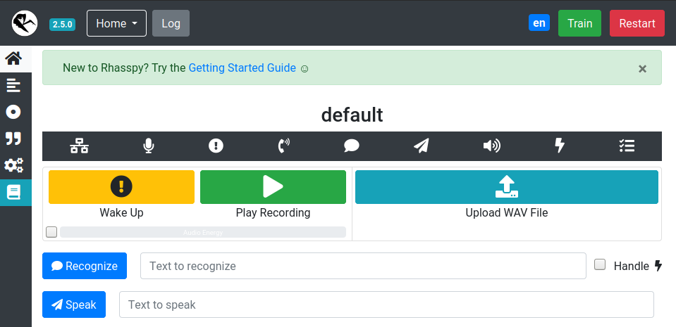

Congratulations! From here, you can follow the [getting started guide](#getting-started-guide) to configure your voice assistant. Hit CTRL+C at any time to exit Rhasspy and return to your command prompt.

If you'd like to keep Rhasspy running the background on your Pi and automatically start up after a reboot, run the following command:

```sh
$ docker run -d -p 12101:12101 \
      --name rhasspy \
      --restart unless-stopped \
      -v "$HOME/.config/rhasspy/profiles:/profiles" \
      -v "/etc/localtime:/etc/localtime:ro" \
      --device /dev/snd:/dev/snd \
      rhasspy/rhasspy \
      --user-profiles /profiles \
      --profile en
```

---

## Server with Satellites

A common usage scenario for Rhasspy is to have one or more low power satellites connect to a more powerful central server (called the "base" station). These satellites are typically Raspberry Pi's, and are responsible for:

* [Wake word](wake-word.md) detection
* [Audio recording](audio-input.md) from a microphone
* [Audio playback](audio-output.md) to a speaker

The base station, typically a standard desktop or [Intel NUC](https://www.intel.com/content/www/us/en/products/boards-kits/nuc.html), is responsible for:

* [Speech to text](speech-to-text.md)
* [Intent recognition](intent-recognition.md)
* [Text to speech](text-to-speech.md)
* [Intent handling](intent-handling.md)

<div style="border: 1px solid red; padding: 5px; margin: 0 0 10px 0;">
    <strong>NOTE:</strong> Training is only done on the base station
</div>

In this tutorial, we will configure **two instances** of Rhasspy: one as a satellite and one as a base station. This can be done using either Rhasspy's [MQTT API](reference.md#mqtt-api) or [HTTP API](reference.md#http-api) depending on whether or not the satellite and base station are connected to the same MQTT broker. It's usually easier to set up satellites with HTTP, but using MQTT allows for more flexibility and speed.

* [Base/Satellite over HTTP](#remote-http-server)
* [Base/Satellite over MQTT](#shared-mqtt-broker)

### Remote HTTP Server

You can connect satellites to a Rhasspy base station *without* needing to worry about a shared MQTT broker or conflicting site ids. Rhasspy's built-in [HTTP API](reference.md#http-api) allows for any external client, including a satellite, to do request speech to text, intent recognition, etc. from another instance of Rhasspy.

In this model, the satellite runs it's own [dialogue manager](services.md#dialogue-manager) and a "remote" version of each service that it will requesting from the base station. As far as the satellite is concerned, it's a completely isolated instance of Rhasspy that just happens to have some functionality done externally. From the base station's perspective, the satellite is just another HTTP client making API requests.

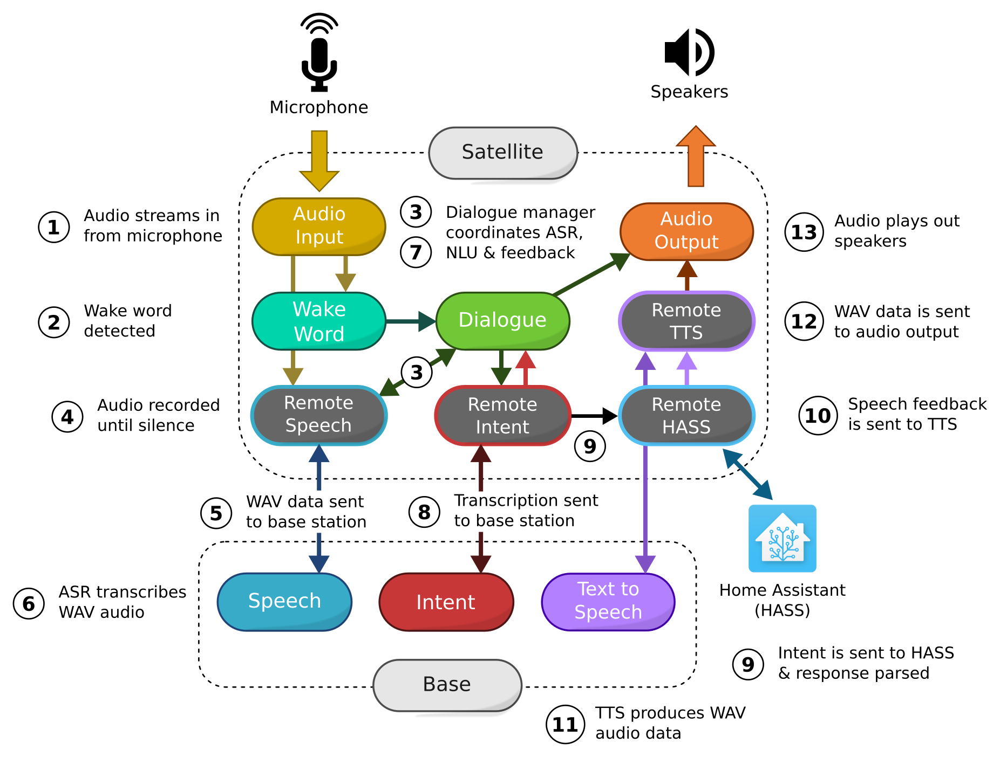

The diagram above shows a satellite that does remote speech to text, intent recognition, and text to speech. For completeness, it also communicates with an instance of Home Assistant. Once the wake word is detected, audio is recorded **locally** until silence. At that point, the WAV audio is POST-ed to [`/api/speech-to-text`](reference.md#api_speech_to_text) on the base station. The transcription flows through the satellite's dialogue manager and out to [`/api/text-to-intent`](reference.md#api_text_to_intent) again on the base station. The intent is sent to Home Assistant, and speech feedback is transformed to audio on the base station through [`/api/text-to-speech`](reference.md#text_to_speech). This audio is then finally played locally on the satellite's speakers.

It's important to note that any of the external functionality (speech to text, text to intent, text to speech) could be done locally on the satellite, on a different instance of Rhasspy, or through any service compatible with the [HTTP API](reference.md#http-api). Any combination is possible!

#### HTTP Example

In this example, we'll start two instances of Rhasspy on two **different** machines and configure one of them (the "satellite") to make requests to the other (the "base"). It's important that these are running on separate machines to avoid HTTP port conflicts (12101).

Let's start a base station on the first machine named `rhasspy-base`:

```bash
docker run -it \
    -v "$HOME/.config/rhasspy/profiles:/profiles" \
    rhasspy/rhasspy \
    --profile en \
    --user-profiles /profiles
```

The base station web UI will be accessible at http://rhasspy-base:12101 where `rhasspy-base` is the hostname or IP address of your base station machine.

Starting the satellite is similiar on a second machine named `rhasspy-satellite`:

```bash
docker run -it \
    -v "$HOME/.config/rhasspy/profiles:/profiles" \
    --device /dev/snd \
    rhasspy/rhasspy \
    --profile en \
    --user-profiles /profiles
```

Note that on the satellite we add `--device /dev/snd` to allow Docker access to the microphone.

The satellite web UI will be accessible at http://rhasspy-satellite:12101 where `rhasspy-satellite` is the hostname or IP address of your satellite machine.

#### Satellite Settings

On your satellite, set the speech to text, intent recognition, and (optionally) the text to speech services to "Remote HTTP". Make sure to also set "Dialogue Management" to "Rhasspy", and enable audio recording, wake word, and audio playing.

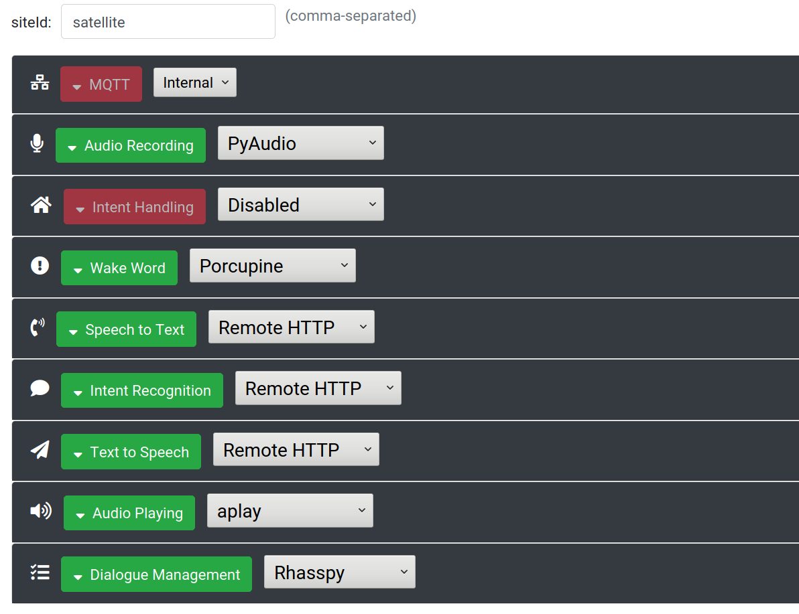

Next, expand each "Remote HTTP" service and set the [appropriate HTTP end-point](reference.md#http-api) on your Rhasspy base station. For example, the URL for speech to text should be something like `http://rhasspy-base:12101/api/speech-to-text`. **Make sure** to leave the `/api/...` part of the URL intact.

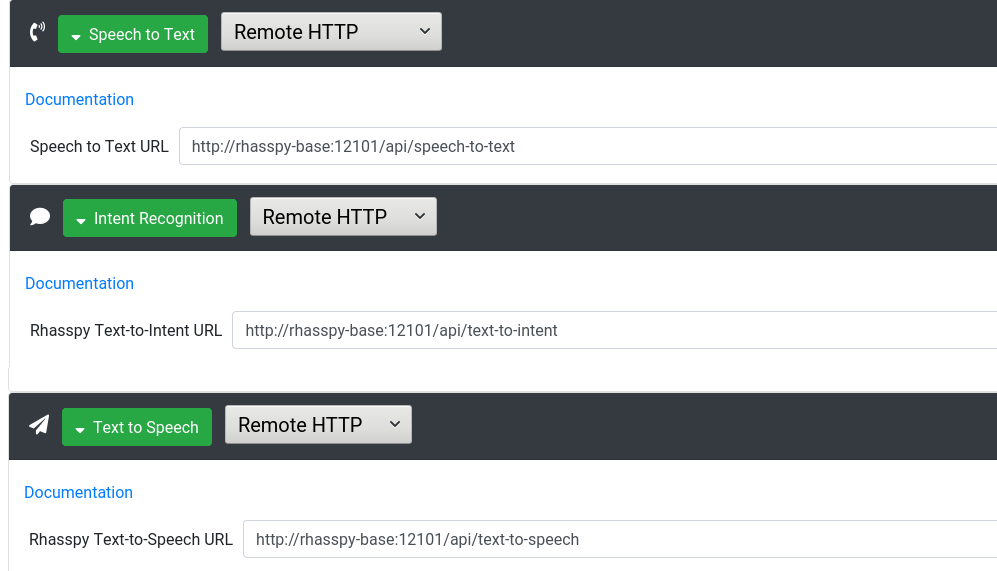

Click "Save Settings" and restart your satellite. You **do not** need to do any training on the satellite.

#### Base Station Settings

Your base station needs to have speech to text, intent recognition, and (optionally) text to speech services enabled. Make sure to save settings, restart Rhasspy, download profile artifacts, update sentences, and **train the profile** on your base station.

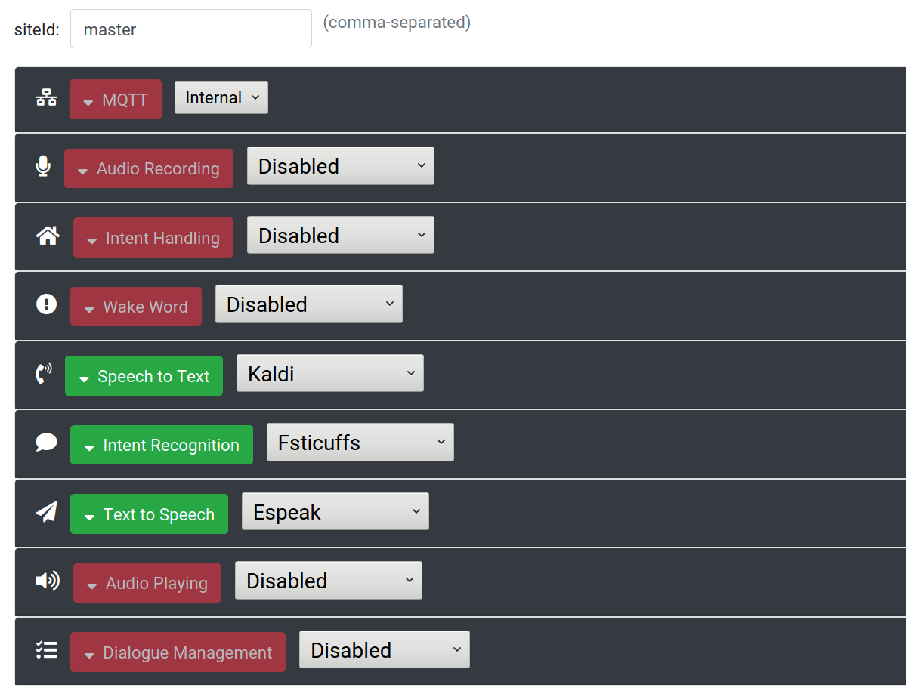

You do not need to run a dialogue manager on the base station, since wake/ASR/NLU coordinate will be done on the satellite.

#### Testing

If all is working, you should be able to speak the wake word + voice command to the satellite and have the recognized intent show up on its test page. Something like "porcupine (pause) turn on the living room lamp".

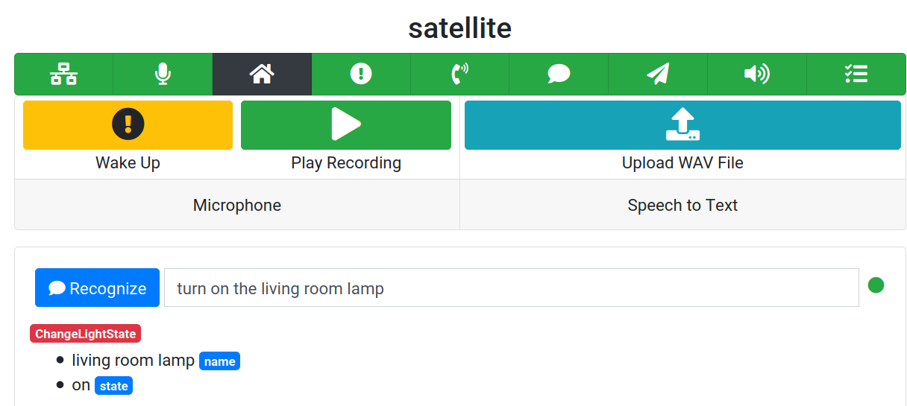

### Shared MQTT Broker

If your base station and satellite(s) are all connected to a single MQTT broker, they can easily share information. The challenge, in fact, is making sure they don't share too much!

Before diving into this example, it's critical to have the correct mental model of how Rhasspy services communicate over MQTT. Central to this communication is the **site id**. Almost every [MQTT message](reference.md#mqtt-api) contains a `site_id` property, either embedded in the JSON payload or as part of the MQTT topic. Each Rhasspy service will check this property against an internal whitelist and *discard any message* that contains an "unknown" `site_id`.

When you set a site id in your Rhasspy settings, all of the services automatically whitelist it:


A satellite, however, should have a *different* site id than the base station. By default, the base station will ignore all messages from a satellite even if they're connected to the same MQTT broker. This is where the "satellite site ids" for each service come from:

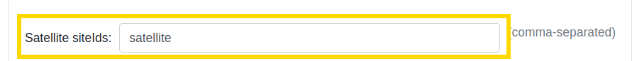

When you add one or more satellite site ids to a service, such as speech to text, that service will listen for and response to MQTT messages from that Rhasspy instance. Importantly, the responses will have the same site id as their source. Derived messages also contain the source site id, so when a satellite's [hotword detection](reference.md#hotword_detected) is captured by the base station's [dialogue manager](services.md#dialogue-manager), the derived [ASR start listening](reference.md#asr_startlistening) message contain the satellite's site id.

In the diagram below, a satellite and base station are connected to the same MQTT broker. On the base station, the ASR (Speech), NLU (Intent), text to speech, and dialogue services have whitelisted the satellite's site id. The corresponding services on the satellite are all set to "Hermes MQTT" except for dialogue, which can simply be disabled.

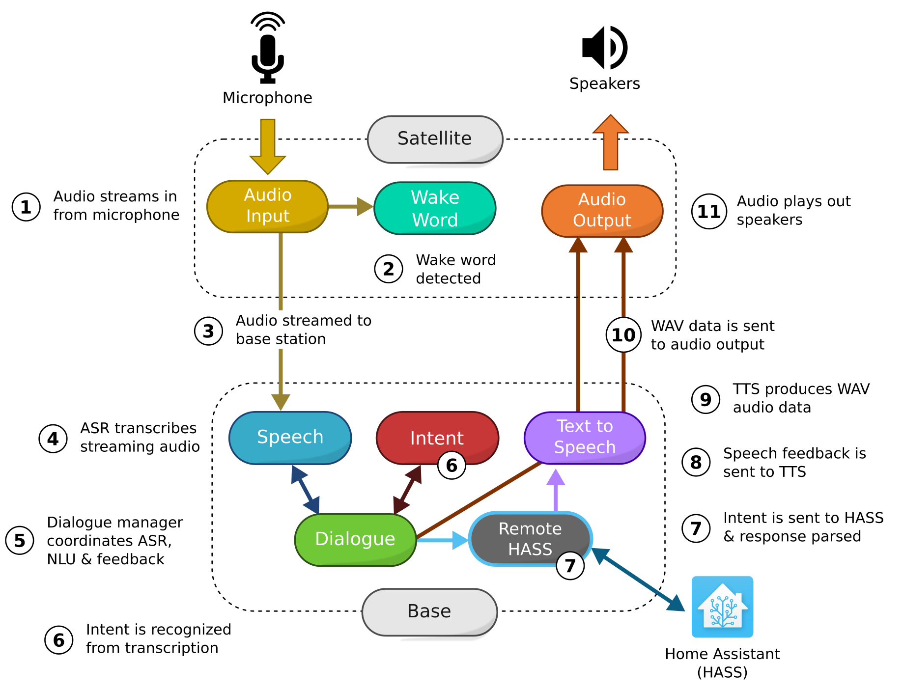

#### MQTT Example

In this example, we'll start two instances of Rhasspy on two **different** machines and configure them to connect to the same external MQTT broker. The base station will have the satellite's site id whitelisted so it can perform speech to text, intent recognition, etc.

Let's start a base station on the first machine named `rhasspy-base`:

```bash
docker run -it \
    -v "$HOME/.config/rhasspy/profiles:/profiles" \
    rhasspy/rhasspy \
    --profile en \
    --user-profiles /profiles
```

The base station web UI will be accessible at http://rhasspy-base:12101 where `rhasspy-base` is the hostname or IP address of your base station machine.

Starting the satellite is similiar on a second machine named `rhasspy-satellite`:

```bash
docker run -it \
    -v "$HOME/.config/rhasspy/profiles:/profiles" \
    --device /dev/snd \
    rhasspy/rhasspy \
    --profile en \
    --user-profiles /profiles
```

Note that on the satellite we add `--device /dev/snd` to allow Docker access to the microphone.

The satellite web UI will be accessible at http://rhasspy-satellite:12101 where `rhasspy-satellite` is the hostname or IP address of your satellite machine.

#### Satellite Settings

On your satellite, start by changing your "siteId" in the Settings to "satellite". Afterwards, set MQTT to "External" and configure the details of your broker. Set the speech to text, intent recognition, and (optionally) the text to speech services to "Hermes MQTT". Make sure to disable "Dialogue Management", and enable audio recording, wake word, and audio playing.

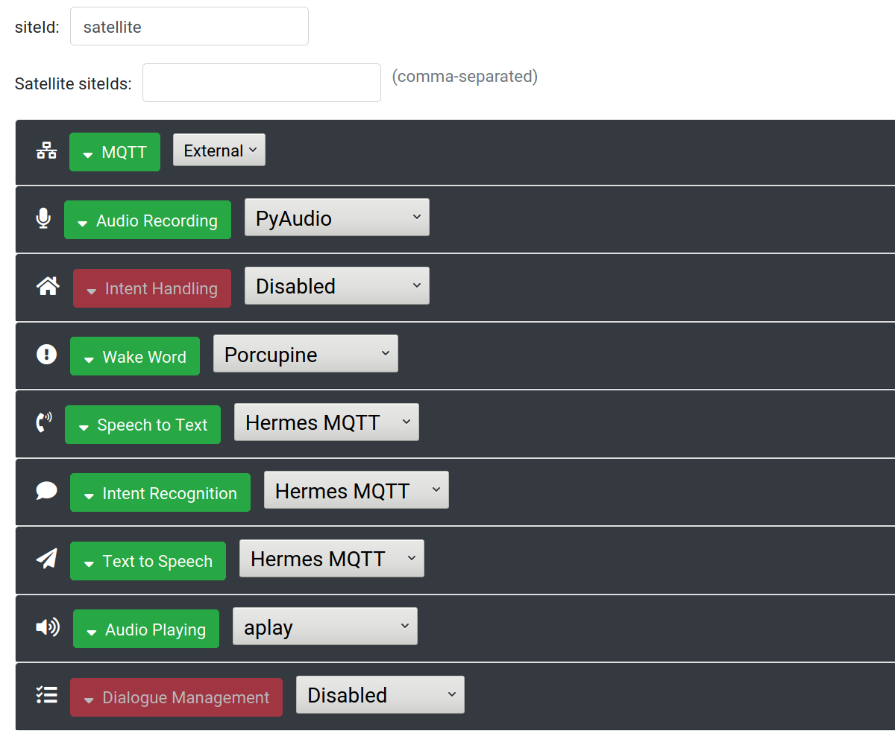

Setting a service to "Hermes MQTT" means that Rhasspy will expect *some* service connected to your broker to handle the appropriate [MQTT messages](reference.md#mqtt-api) for speech to text, etc. In our example this will be the base station, but it could just as easily be another service or Node-RED flow.

#### Base Station Settings

For your base station, also set MQTT to "External" and configure the details of your broker. Next, set Dialogue Management to "Rhasspy" and select your preferred Speech to Text, Intent Recognition, and Text to Speech services.

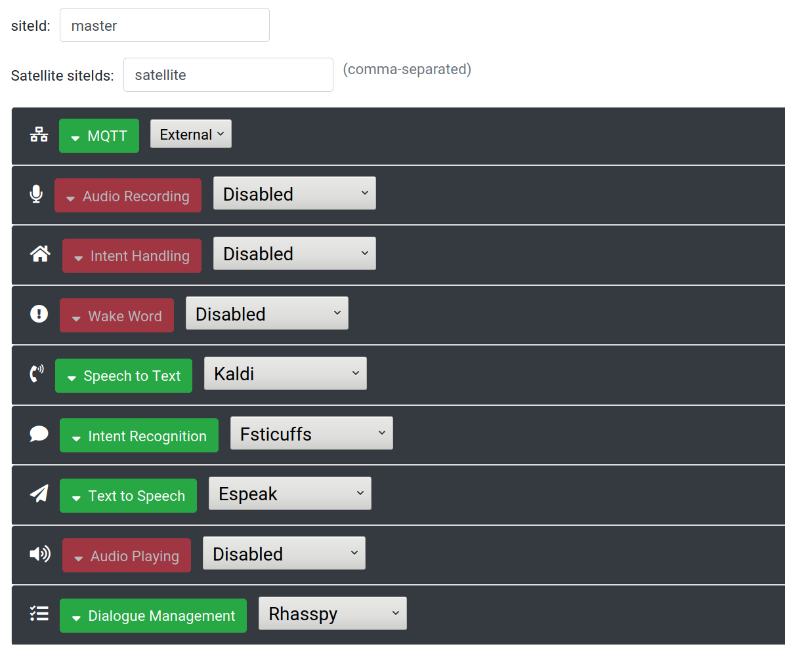

 Under **each service** (including Dialogue Management), add the site id of *each* of your satellites to the "Satellite siteIds" text box (separated by commas). This will cause that particular service to response to MQTT messages coming from that satellite.

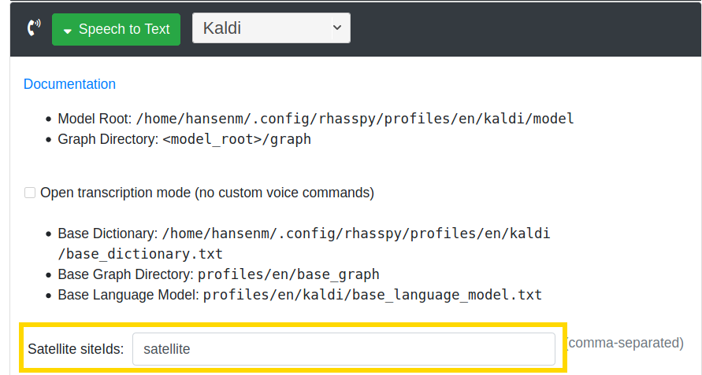

Adding the satellite site id(s) to the dialogue manager is crucial, since it will catch wake word detections, engage the ASR and NLU systems, and dispatch TTS audio playback to the appropriate site.

#### UDP Audio Streaming

By default, your satellite will stream all [recorded audio](reference.md#audioserver_audioframe) over MQTT. This will go to both the wake word service (satellite) and ASR service (base station).

If you wish to keep streaming audio contained on the satellite until the wake word is spoken, you need to configure a UDP audio port for **both the audio recording and wake word services**.

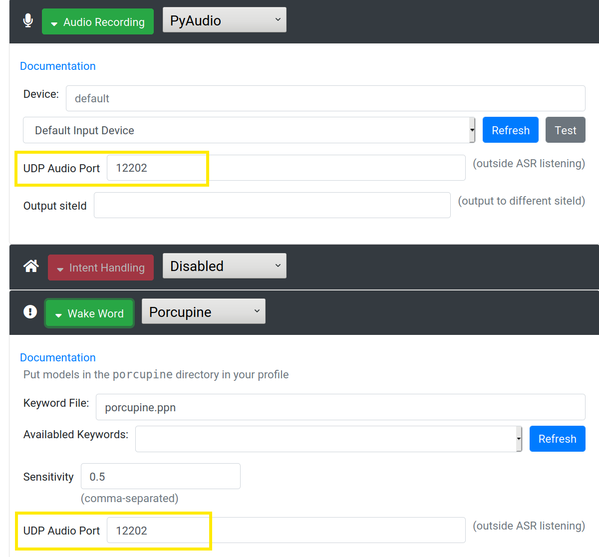

With a UDP audio port set, the microphone audio will go directly to the wake word service (on `127.0.0.1`). When an [`asr/startListening`](reference.md#asr_startlistening) message arrives at the microphone service, it will begin streaming over MQTT. Once an [`asr/stopListening`](reference.md#asr_stoplistening) message is received, audio is streamed again over UDP only.

#### Testing

If all is working, you should be able to speak the wake word + voice command to the satellite and have the recognized intent show up on its test page. Something like "porcupine (pause) turn on the living room lamp".

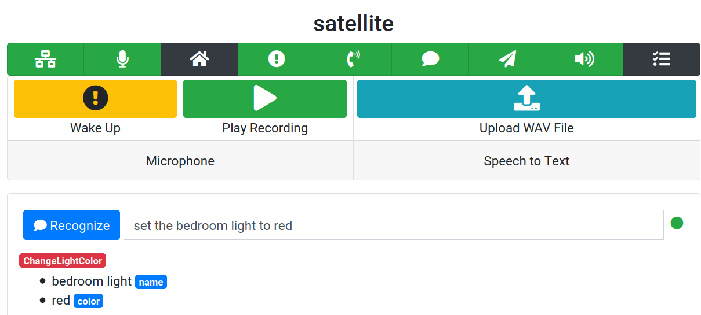

---

## Custom Wakeword with Raven

[Raven](wake-word.md#raven) is a wake word system based on the [Snips Personal Wakeword Detector](https://medium.com/snips-ai/machine-learning-on-voice-a-gentle-introduction-with-snips-personal-wake-word-detector-133bd6fb568e). It works by comparing incoming audio frames to a set of pre-recorded templates, only signaling a detection if there is a close enough match.

To get started with Raven:

1. Visit the Rhasspy settings page in the web UI and select "Raven" for the "Wake Word" system
2. Save your settings and restart Rhasspy

With the Raven service now started, we can record our examples. Drop down the Raven settings and locate the example "Record" buttons:

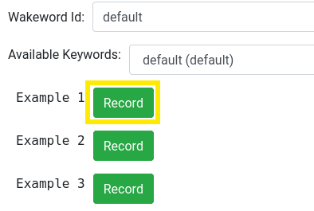

Click the "Record" button next to "Example 1" and wait for a dialogue box to appear that says "Speak wake word":

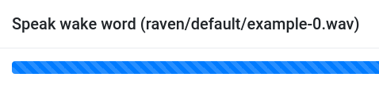

Clearly speak your wake word and then pause. If you microphone is properly configured, the dialogue box should automatically close and a "Recorded" label will be placed next to "Example 1". The dialogue box will not close if there is no audio input or if there is excessive background noise.

Once you've recorded all three examples, make sure to **Restart Rhasspy** so the Raven service can pick up the new templates.

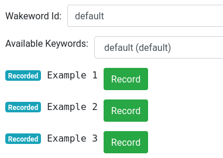

After restarting, try speaking your wake word and see if Rhasspy wakes up. You can increase the sensitivity by lowering the probability threshold below 0.5 (maybe 0.45). Likewise, you can decrease sensitivity by increasing the probability threshold above 0.5 (maybe 0.55).

### Multiple Wake Words

Raven any number of custom wake words. By changing the "Wakeword Id" before recording your examples, you can create a new set of templates. Upon detection, Rhasspy will report this name as `wakewordId` in the [hotword detected message](reference.md#hotword_detected).

Deleting a custom wake word is currently not supported through the web UI (though you can always overwrite the recordings). If you wish to delete a custom wake word, visit the `raven` directory of your Rhasspy profile and simply delete the directory named after your wakeword id.
