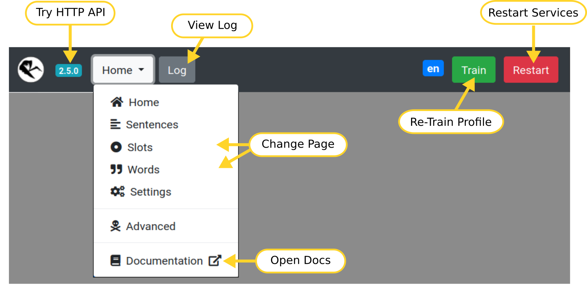
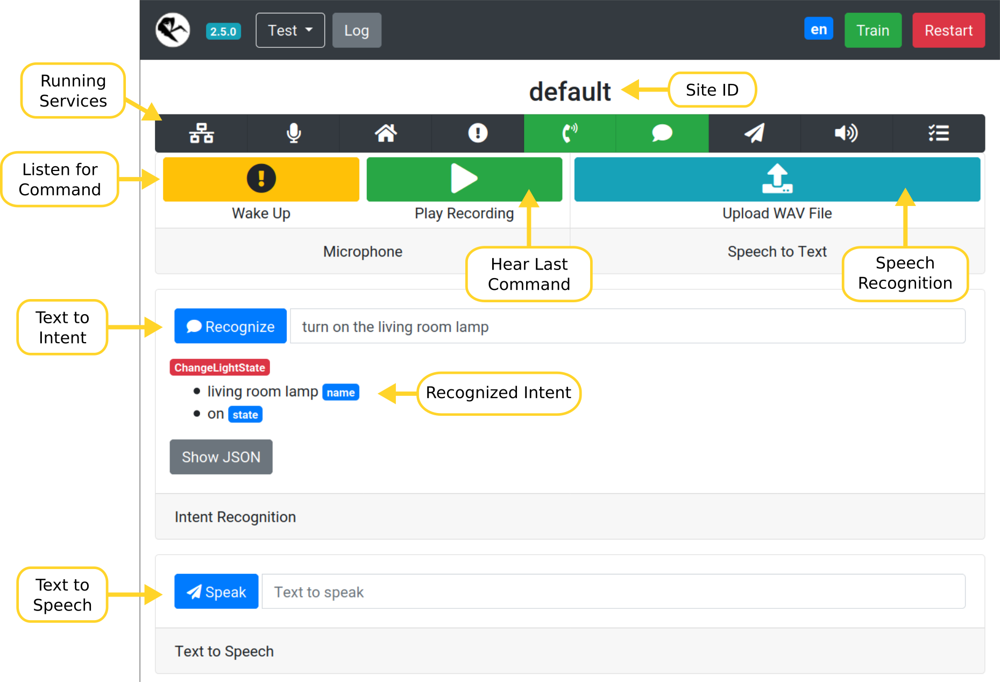
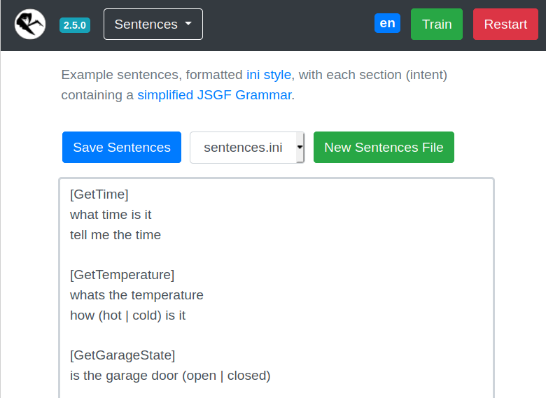
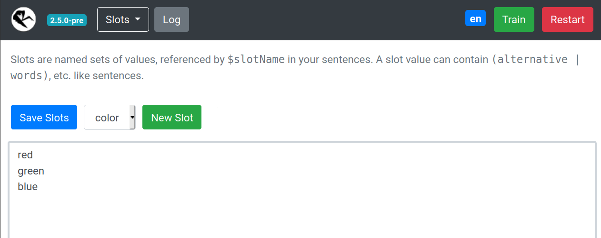
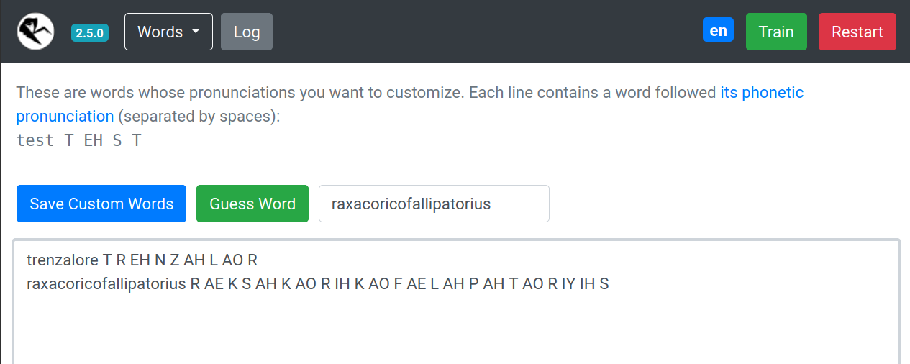
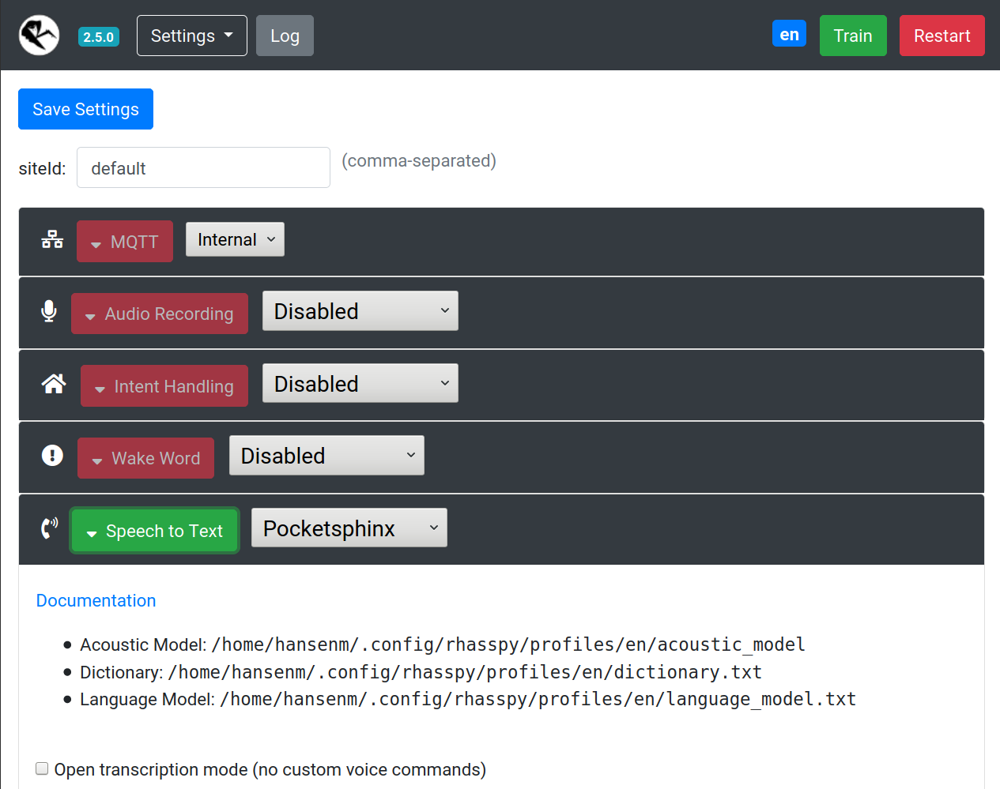
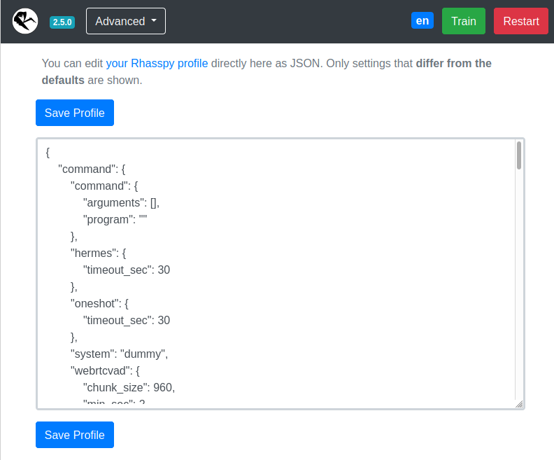
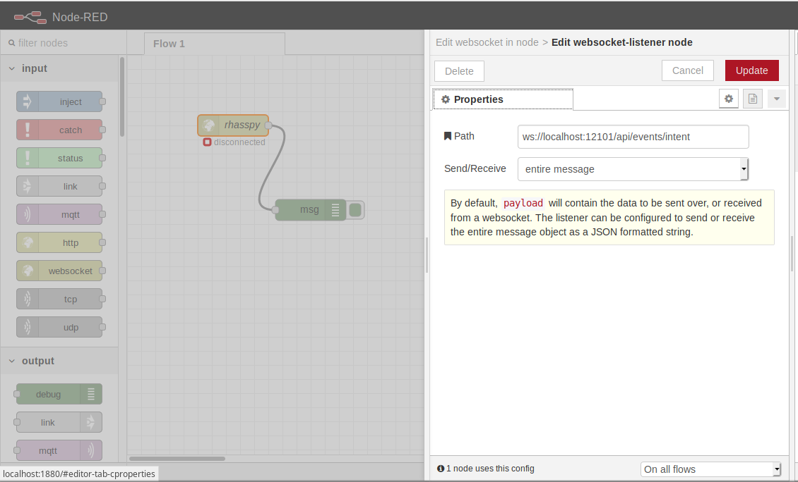

# Usage

You can interact with Rhasspy in more ways than your voice:

* [Web Interface](#web-interface)
* [Home Assistant](#home-assistant)
* [Node-RED with Websockets](#node-red)
* [MQTT and Snips](#mqtt-and-snips)
* [HTTP API](#http-api)
* [Command Line](#command-line)

## Web Interface

A browser-based interface for Rhasspy is available on port 12101 by default ([http://localhost:12101](http://localhost:12101) if running locally). From this interface, you can test voice commands, add new voice commands, re-train, and edit your profile.

### Top Bar

The top bar of the web interface lets you perform some global actions on Rhasspy, regardless of which page you have selected.



* Click the Rhasspy logo to reload the page
* Click the version number to test the [HTTP API](#http-api)
* Use the dropdown menu to change pages or open the documentation
* The gray `Log` button opens a dialog with log messages
* The green `Train` button will re-train your profile
* The red `Restart` button forces Rhasspy to restart

### Home Page

Test voice and text commands.



* Wake up Rhasspy and have it listen for a voice command
* Upload a WAV file with a voice command
* Enter a text command and Rhasspy recognize the intent
* Speak a sentence using the text to speech system

### Sentences Page

Add new voice commands to Rhasspy using the [template syntax](training.md#sentencesini).



* Edits `sentences.ini` by default
* Create additional template files
    * These should be prefixed by the `sentences_dir` in your [profile](profiles.md). For example, `intents/more-commands.ini`
* The drop down can be used to switch editing between different template files

### Slots Page

Edit your [slots lists](training.md#slots-lists).



* Slot values will overwrite previous ones
* Create new slots (files in your `slots` directory)
* Delete a slot by deleting all values and saving

### Words Page

Teach Rhasspy how to pronounce new words.



* Look up pronunciation(s) for known words (in your profile's `base_dictionary.txt` file)
* Have Rhasspy guess how to pronounce a new (unknown) word
* Add new words to your `custom_words.txt` file

### Settings Page

Simplified interface for editing your [profile](profiles.md).
Rhasspy will automatically restart after saving changes.



### Advanced Page

Direct interface for editing your [profile](profiles.md).
**Be careful!** Entering invalid settings here can cause Rhasspy to not start.



## Home Assistant

Rhasspy communicates with Home Assistant directly over its [REST API](https://developers.home-assistant.io/docs/en/external_api_rest.html).
Specifically, Rhasspy intents are POST-ed to the `/api/intents/handle` endpoint.

You **must** add `intent:` to your Home Assistant `configuration.yaml` to enable the endpoint.

To get started, check out the [built-in intents](https://developers.home-assistant.io/docs/intent_builtin/). You can trigger them by simply naming your Rhasspy intents the same:

```ini
[HassTurnOn]
turn on the (bedroom light){name}

[HassTurnOff]
turn off the (bedroom light){name}
```

If you have an entity named "bedroom light" in Home Assistant, you can now turn it on and off from Rhasspy!

Adding a custom intent to Home Assistant is done with the [intent script](https://www.home-assistant.io/integrations/intent_script) component. For example, a `GetTemperature` intent in Rhasspy might be defined as:

```ini
[GetTemperature]
whats the temperature
```

In Home Assistant's `configuration.yaml` file, add:

```yaml
intent_script:
  GetTemperature:  # Intent type
    speech:
      text: We have {{ states.sensor.temperature }} degrees
    action:
      service: notify.notify
      data_template:
        message: Hello from an intent!
```

Assuming you have a sensor configured in Home Assistant, you should now be able to ask "what's the temperature" and have Rhasspy speak the response.

### Automatically Downloading Entities

See the [Home Assistant example](https://github.com/rhasspy/rhasspy/tree/master/examples/homeassistant) for a full set of example sentences, slots, and slot programs that will automatically download entity names from your Home Assistant server.

### Events Instead of Intents

Rhasspy can also communicate with Home Assistant using the [events endpoint](https://developers.home-assistant.io/docs/en/external_api_rest.html#post-api-events-lt-event_type). If you choose this communication method, you must write your own automation scripts to handle these events.

If you have a Rhasspy intent named `ChangeLightColor` with `name` and `color` slots like in the [RGB light example](index.md#rgb-light-example), then Home Assistant will receive an event of type `rhasspy_ChangeLightColor` whose event data is:

```json
{
  "name": "bedroom",
  "color": "red"
}
```

when you say "set the bedroom to red". You should write a custom [automation with an event trigger](https://www.home-assistant.io/docs/automation/trigger/#event-trigger) to do something when this event arrives. Catching the example event would look like:

```yaml
automation:
  trigger:
    platform: event
    event_type: rhasspy_ChangeLightColor
    event_data:
      color: red
  action:
    ...
```

### Getting the Spoken Text

The Home Assistant event will contain some extra "meta" slots besides the ones you specify:

* `_text` - spoken voice command text with [substitutions](training.md#substitutions)
* `_raw_text` - literal transcription of voice command
* `_site_id` - Hermes site ID for the recognized intent
* `_intent` - Hermes intent object

## Node-RED

Rhasspy can interact directly with [Node-RED](https://nodered.org) directly through [websockets](usage.md#websocket-events).
Simply add a websocket input and set the path to `ws://<rhasspy>:12101/api/events/intent` where `<rhasspy>` is the hostname or IP address of your Rhasspy server.
Make sure to also set send/receive to "entire message".



More example flows are available [on Github](https://github.com/synesthesiam/rhasspy/tree/master/examples/nodered).

### WebSocket Events

Rhasspy supports multiple websocket event endpoints:

* [`/api/events/intent`](reference.md#api_events_intent)
    * Intent recognized or not
* [`/api/events/wake`](reference.md#api_events_wake)
    * Wake word detected
* [`/api/events/text`](reference.md#api_events_text)
    * Speech transcription
* [`/api/mqtt`](reference.md#api_ws_mqtt)
    * Send/receive raw MQTT messages

#### WebSocket Intents

Whenever a voice command is recognized, Rhasspy emits JSON events over a websocket connection available at `ws://YOUR_SERVER:12101/api/events/intent` (replace `ws://` with `wss://` if you're using [secure hosting](usage.md#secure-hosting-with-https)).
You can listen to these events in a [Node-RED](https://nodered.org) flow, and easily add offline, private voice commands to your home automation set up!

For the `ChangeLightState` intent from the [RGB Light Example](index.md#rgb-light-example), Rhasspy will emit a JSON event like this over the websocket:

```json
{
  "text": "set the bedroom light to red",
  "intent": {
    "name": "ChangeLightColor",
    "confidence": 1
  },
  "entities": [
    {
      "entity": "name",
      "value": "bedroom"
    },
    {
      "entity": "color",
      "value": "red"
    }
  ],
  "slots": {
    "name": "bedroom",
    "color": "red"
  }
}
```

#### WebSocket Wake

When the wake word is detected, or Rhasspy is woken up via the `/api/listen-for-command` HTTP endpoint, a JSON event is emitted at `ws://YOUR_SERVER:12101/api/events/wake` (`wss://` if using HTTPS) like:

```json
{
    "wakewordId": "default",
    "siteId": "default"
}
```

The `wakewordId` is set using the model or file name of your wakeword model (e.g., `porcupine` for `porcupine.ppn`). The `siteId` comes from your `mqtt.siteId` profile setting.

#### WebSocket Transcriptions

Each time a voice command is transcribed, Rhasspy emits a JSON event at `ws://YOUR_SERVER:12101/api/events/text` (`wss://` if using HTTPS) like:

```json
{
    "text": "text from voice command",
    "wakewordId": "default",
    "siteId": "default"
}
```

The transcription is contained in the `text` property. `wakewordId` is the id of the wakeword that initiated the voice command (or `default`). The `siteId` comes from your `mqtt.siteId` profile setting.

### Websocket MQTT Messages

You can send and receive MQTT messages over a special websocket endpoint at `ws://YOUR_SERVER:12101/api/mqtt` (`wss://` if using HTTPS).

#### Subscribing to Topics

Send a JSON message with the following form:

```json
{
  "type": "subscribe",
  "topic": "the/mqtt/topic"
}
```

#### Receiving Messages

When a message whose topic you have subscribed to is received, you will get a JSON message like:

```json
{
  "topic": "/the/mqtt/topic",
  "payload": ...
}
```

You should only subscribe to messages whose payloads can be serialized in JSON.

#### Publishing Messages

To send a message to all of Rhasspy's services, send a JSON message like:

```json
{
  "type": "publish",
  "topic": "/the/mqtt/topic",
  "payload": ...
}
```

#### Single Topic

If you only need to receive messages from a single MQTT topic, you can connect to `ws://YOUR_SERVER:12101/api/mqtt/<TOPIC>` (`wss://` if using HTTPS).

When a message is received on this topic, you will receive a JSON message like:

```json
{
  "topic": "/the/mqtt/topic",
  "payload": ...
}
```

## MQTT and Snips

Rhasspy is able to interoperate with Snips.AI services using the [Hermes protocol](https://docs.snips.ai/reference/hermes) over [MQTT](http://mqtt.org). See the description of [Rhasspy's services](services.md) for details.

## HTTP API

Rhasspy features a comprehensive HTTP API available at `/openapi/`, documented with [OpenAPI 3](https://github.com/OAI/OpenAPI-Specification) (Swagger). See the [HTTP API reference](reference.md#http-api) for more details.

### Secure Hosting with HTTPS

If you need to access Rhasspy's web interface/API through HTTPS (formally SSL), you can provide a certificate and key file via command-line parameters or the Hass.io configuration.

If you're running Rhasspy via Docker or in a virtual environment, add `--certfile <CERT_FILE>` and `--keyfile <KEY_FILE>` to the command-line arguments where `<CERT_FILE>` is your SSL certificate (PEM) and `<KEY_FILE>` is your SSL private key file.

You can generate a self-signed certificate with the following command:

    openssl req -x509 -newkey rsa:4096 -nodes -out cert.pem -keyout key.pem -days 365

After answering the series of questions, you should have `cert.pem` and `key.pem` in your current directory. Then run Rhasspy with:

    <RHASSPY COMMAND> --certfile cert.pem --keyfile key.pem

The web interface will now be available at [https://localhost:12101](https://localhost:12101) and the web socket events at `wss://localhost:12101/api/events/intent`

In Hass.io, you will need to set the following options via the web interface or in your JSON configuration:

* `ssl`: `true`
* `certfile`: `cert.pem`
* `keyfile`: `key.pem`

## Command Line

A command-line client for the Rhasspy [HTTP API](#http-api) is available in the [rhasspy-client](https://github.com/rhasspy/rhasspy-client) library.

You can install it with:

```bash
pip install rhasspy-client
```

and then run it:

```bash
rhasspy-client --help
```
