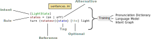
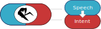
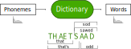
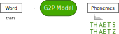
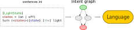
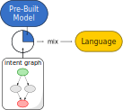
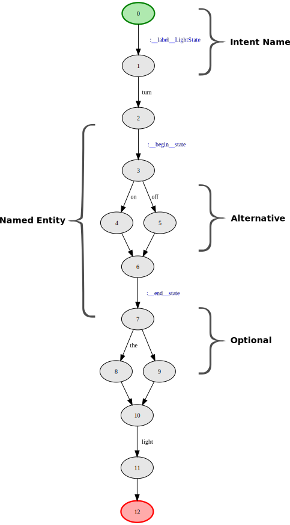
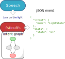

# How Rhasspy Works

At a high level, Rhasspy transforms audio data (voice commands) into [JSON](https://json.org) events.


The voice commands are specified beforehand in a [compact, text-based format](training.md):

```ini
[LightState]
states = (on | off)
turn (<states>){state} [the] light
```

This format supports:

* `[optional words]`
* `(alternative | choices)`
* `name = body` - rules
* `<rule name>` - rule references
* `(value){name}` - tags
* `input:output` - substitutions
* `$movies` - slot lists
* `1..100` - number sequences
* `TEXT!float` - converters

During training, Rhasspy [generates artifacts](#conclusion) that can recognize and decode the specified voice commands. If these commands change, Rhasspy must be re-trained.



---

## Core Components

Rhasspy core functionality can be broken down into [speech](#speech-to-text) and [intent](#text-to-intent) recognition components.



When voice commands are recognized by the speech component, the transcription is given to the intent recognizer to process. The final result is a structured JSON event with:

1. An intent name
2. Recognized slots/entities
3. Optional metadata about the speech recognition process
    * Input text, time, tokens, etc.

For example:

```json
{
    "text": "turn on the light",
    "intent": {
        "name": "LightState"
    },
    "slots": {
        "state": "on"
    }
}
```

---

## Speech to Text

The offline transcription of voice commands in Rhasspy is handled by one of three open source systems:

* [Pocketsphinx](https://github.com/cmusphinx/pocketsphinx)
    * CMU (2000)
* [Kaldi](https://kaldi-asr.org)
    * Johns Hopkins (2009)
* [DeepSpeech](https://github.com/mozilla/DeepSpeech)
    * Mozilla (v0.6, 2019)
    
Pocketsphinx and Kaldi both require:

* An [acoustic model](#acoustic-model)
    * Maps [audio features](https://en.wikipedia.org/wiki/Mel-frequency_cepstrum) to [phonemes](https://en.wikipedia.org/wiki/Phoneme)
* A [pronunciation dictionary](#pronunciation-dictionary)
    * Maps [phonemes](https://en.wikipedia.org/wiki/Phoneme) to words
* A [language model](#language-model)
    * Describes how often [words follow other words](https://en.wikipedia.org/wiki/Language_model)
    
DeepSpeech combines the acoustic model and pronunciation dictionary into a single neural network. It still uses a language model, however.


### Acoustic Model

An acoustic model maps acoustic/speech features to likely phonemes in a given language. 

Typically, [Mel-frequency cepstrum coefficients](https://en.wikipedia.org/wiki/Mel-frequency_cepstrum) (abbreviated MFCCs) are used as acoustic features. These mathematically highlight useful aspects of human speech.


[Phonemes](https://en.wikipedia.org/wiki/Phoneme) are language (and even locale) specific. They are the *indivisible units* of word pronunciation. Determining a language's phonemes requires a linguistic analysis, and there may be some debate over the final set. Individual human languages typically have no more than a few dozen phonemes. The set of all possible phonemes can be represented using the [International Phonetic Alphabet](https://en.wikipedia.org/wiki/International_Phonetic_Alphabet).

An acoustic model is a statistical mapping between audio features (MFCCs) and one or more phonemes. This mapping is learned from a large collection of speech examples along with their corresponding transcriptions. A pre-built [pronunciation dictionary](#pronunciation-dictionary) is needed to map transcriptions back to phonemes before a model can be trained. Collecting, transcribing, and validating these large speech data sets is a [limiting factor in open source speech recognition](https://voice.mozilla.org).

### Pronunciation Dictionary

A dictionary that maps sequences of phonemes to words is needed both to train an acoustic model and to do speech recognition. More than one mapping (pronunciation) is possible for each word.

For practical purposes, let's consider a word to be just the "stuff between whitespace" in text. Regardless of how exactly you define what a "word" is, what matters most is consistency: someone needs to decide if compound words (like "pre-built"), contractions, etc. are single ("prebuilt") or multiple words ("pre" and "built"). 



Below is a table of examples phonemes for U.S. English from the [CMU Pronouncing Dictionary](http://www.speech.cs.cmu.edu/cgi-bin/cmudict).

| Phoneme | Word    | Pronunciation |
| ------- | ------- | -------       |
| AA      | odd     | AA D          |
| AE      | at      | AE T          |
| AH      | hut     | HH AH T       |
| AO      | ought   | AO T          |
| AW      | cow     | K  AW         |
| AY      | hide    | HH AY D       |
| B       | be      | B  IY         |
| CH      | cheese  | CH IY Z       |
| D       | dee     | D  IY         |
| DH      | thee    | DH IY         |
| EH      | Ed      | EH D          |
| ER      | hurt    | HH ER T       |
| EY      | ate     | EY T          |
| F       | fee     | F  IY         |
| G       | green   | G  R  IY N    |
| HH      | he      | HH IY         |
| IH      | it      | IH T          |
| IY      | eat     | IY T          |
| JH      | gee     | JH IY         |
| K       | key     | K  IY         |
| L       | lee     | L  IY         |
| M       | me      | M  IY         |
| N       | knee    | N  IY         |
| NG      | ping    | P  IH NG      |
| OW      | oat     | OW T          |
| OY      | toy     | T  OY         |
| P       | pee     | P  IY         |
| R       | read    | R  IY D       |
| S       | sea     | S  IY         |
| SH      | she     | SH IY         |
| T       | tea     | T  IY         |
| TH      | theta   | TH EY T  AH   |
| UH      | hood    | HH UH D       |
| UW      | two     | T  UW         |
| V       | vee     | V  IY         |
| W       | we      | W  IY         |
| Y       | yield   | Y  IY L  D    |
| Z       | zee     | Z  IY         |
| ZH      | seizure | S  IY ZH ER   |

More [recent versions](https://github.com/cmusphinx/cmudict) of this dictionary include [stress](https://en.wikipedia.org/wiki/Stress_(linguistics)), indicating which parts of the word are emphasized during pronunciation.

During training, Rhasspy copies pronunciations for every word in your voice command templates from a large pre-built pronunciation dictionary. Words that can't be found in this dictionary have their pronunciations guess using a pre-trained [grapheme to phoneme](#grapheme-to-phoneme) model.

#### Grapheme to Phoneme

A [grapheme](https://en.wikipedia.org/wiki/Grapheme) to phoneme (G2P) model can be used to guess the phonetic pronunciation of words. This is a statistical model that maps sequences of characters (graphemes) to sequences of phonemes, and is typically trained from a large pre-built pronunciation dictionary. Rhasspy uses a tool called [Phonetisaurus](https://github.com/AdolfVonKleist/Phonetisaurus) for this purpose.



### Language Model

A language model describes how often some words follow others. It is common to see models that go from one to three words in a row.

Language models are created from a large text corpus, such as books, news sites, Wikipedia, etc. Not all combinations will be present in the training materal, so their probabilities have to be predicted by [a heuristic](http://mlwiki.org/index.php/Smoothing_for_Language_Models).

Below is a made-up example of word singleton/pair/triplet probabilities for a corpus that only contains the words "sod", "sawed", "that", "that's", and "odd".

```
0.2  sod
0.2  sawed
0.2  that
0.2  that's
0.2  odd

0.25  that's odd
0.25  that sawed
0.25  that sod
0.25  odd that

0.5  that's odd that
0.5  that sod that
```

During speech recognition, incoming phonemes may match more than one word from the pronunciation dictionary. The language model helps narrow down the possibilities by telling the speech recognizer that some word combinations are very unlikely and can be ignored.


### Sentence Fragments

The language model does not contain probabilities for entire sentences, only sentence *fragments*. Getting a complete sentence from the speech recognizer requires a few tricks:

* Adding virtual start/stop sentence "words" (`<s>`, `</s>`)
    * `<s> what time` is the start of a sentence "what time..." 
    * `is it </s>` is the end of a sentence "...is it?" 
* Use sliding time windows
    * Fragments are stitched together using overlapping windows
    * "what time", "time is", "is it" for the sentence "what time is it"
* Breaking audio at long pauses or always assuming a single sentence
    * You can always assume the first "word" is `<s>` (start of sentence)
    * Where to put `</s>` (end of sentence), though?

When using these tricks, the recognized "sentences" may still be non-sensical and have little to do with previous sentences. For example:

```
that sod that that sod that sawed...
```

Modern [transformer neural networks](https://arxiv.org/abs/1810.04805) can handle long-term dependencies within and between sentences much better, but:

* They require a huge amount of training data
* They can be slow/resource intensive to (re-)train and execute without specialized hardware

For Rhasspy's intended use (pre-specified, short voice commands) the tricks above are usually good enough. While cloud services can be used with Rhasspy, there are trade-offs in privacy and resiliency (loss of Internet or cloud account).

### Language Model Training

During training, Rhasspy generates a custom language model based on your voice command templates (usually in [ARPA format](https://cmusphinx.github.io/wiki/arpaformat/)). Thanks to the [opengrm](http://www.opengrm.org/twiki/bin/view/GRM/NGramLibrary) library, Rhasspy can take the intermediary sentence graph produced during the initial stages of training and *directly* generate a language model! This enables Rhasspy to train in seconds, even for millions of possible voice commands.



### Language Model Mixing

Rhasspy's custom language model can optionally be [mixed](training.md#language-model-mixing) with a much larger, pre-built language model. Depending on how much weight is given to either model, this will increase the probability of your voice commands against a background of general sentences in the profile's language.



When mixed appropriately, Rhasspy is capable of (nearly) open-ended speech recognition with a preference for the user's voice commands. Unfortunately, this will usually result in lower speech recognition performance and many more intent recognition failures (which is only trained on the user's voice commands).

---

## Text to Intent

The speech recognition system(s) in Rhasspy produce text transcriptions that are then given to an intent recognition system. When both speech and intent systems are trained together from [the same template file](training.md), all valid commands (with minor variations) should be correctly translated to JSON events.

Rhasspy transforms the set of possible voice commands into a graph that acts as a [finite state transducer](https://en.wikipedia.org/wiki/Finite-state_transducer) (FST). When given a valid sentence as input, this transducer will output the (transformed) sentence along with "meta" words that provide the sentence's intent and named entities.

As an example, consider the sentence template below for a `LightState` intent:

```
[LightState]
states = (on | off)
turn (<states>){state} [the] light
```

When trained with this template, Rhasspy will generate a graph like this:



Each state is labeled with a number, and edges (arrows) have labels as well. The edge labels have a special format, which represent the input required to traverse the edge and the corresponding output. A colon (":") separates the [input/output words](training.md#substitutions) on an edge, and is omitted when both input and output are the same. Output "words" that begin with two underscores ("__") are "meta" words that provide additional information about the recognized sentence.

The FST above will accept all possible sentences in the template file:


* turn on the light
* turn on light
* turn off the light
* turn off light

This is the output when each sentence is accepted by the FST:

| Input                | Output                                                               |
| -------              | --------                                                             |
| `turn on the light`  | `__label__LightState turn __begin__state on __end__state the light`  |
| `turn on light`      | `__label__LightState turn __begin__state on __end__state light`      |
| `turn off the light` | `__label__LightState turn __begin__state off __end__state the light` |
| `turn off light`     | `__label__LightState turn __begin__state off __end__state light`     |

The `__label__` notation is taken from [fasttext](https://fasttext.cc), a highly-performant sentence classification framework. A single meta `__label__` word is produced for each sentence, labeling it with the property intent name.

The `__begin__` and `__end__` meta words are used by Rhasspy to construct the JSON event for each sentence. They mark the beginning and end of a [tagged](training.md#tags) block of text in the original template file -- e.g., `(on | off){state}`. These begin/end symbols can be easily translated into a common scheme for annotating text corpora (IOB) in order to train a Named Entity Recognizer (NER). [flair](http://github.com/zalandoresearch/flair) can read such corpora, for example, and train NERs using [PyTorch](https://pytorch.org).

[Rhasspy's NLU library](https://github.com/rhasspy/rhasspy-nlu) currently uses the following set of meta words:

* `__label__INTENT`
    * Sentence belongs to intent named `INTENT`
* `__begin__TAG`
    * Beginning of [tag](training.md#tags) named `TAG`
* `__end__TAG`
    * End of [tag](training.md#tags) named `TAG`
* `__convert__CONV`
    * Beginning of [converter](training.md#converters) named `CONV`
* `__converted__CONV`
    * End of [converter](training.md#converters) named `CONV`
* `__source__SLOT`
    * Name of [slot list](training.md#slots-lists) where text came from
* `__unpack__PAYLOAD`
    * Decodes `PAYLOAD` as a base64-encoded string and then interprets as edge label

### fsticuffs

Rhasspy's FST-based intent recognizer is called `fsticuffs`. It takes the intent graph generated during training and uses it to convert transcriptions from the speech system into JSON events.



Intent recognition is done by simply running the transcription through the intent graph and parsing the output words (and meta words). The transcription "turn on the light" is split (by whitespace) into the words `turn` `on` `the` `light`.

Following a path through the example intent graph above with the words as input symbols, this will output:

`__label__LightState` `turn` `__begin__state` `on` `__end__state` `the` `light`

A fairly simple state machine receives these symbols/words, and constructs a structured intent that is ultimately converted to JSON. The intent's name and named entities are recovered using the `__label__`, `__begin__`, and `__end__` meta words. All non-meta words are collected for the final text string, which includes [substitutions](training.md#substitutions) and [conversions](training.md#converters). The final output is something like this:

```json
{ 
  "text": "turn on the light",
  "intent": {
    "name": "LightState"
  },
  "slots": {
    "state": "on"
  }
}
```

#### Fuzzy FSTs

What if `fsticuffs` were to receive the transcription "would you turn on the light"? This is not a valid example voice command, but seems reasonable to accept via text input (e.g., chat).

Because `would` and `you` are not words encoded in the intent, the FST will fail to recognize it. To deal with this, Rhasspy allows [stop words](https://en.wikipedia.org/wiki/Stop_words) to be silently passed over during recognition if they would not have been accepted. This "fuzzy" recognition mode is slower, but allows for may more sentences to be accepted.

## Conclusion

When trained, Rhasspy produces the following artifacts:

* A [pronunciation dictionary](#pronunciation-dictionary) containing *only* the words from your [voice command templates](training.md)
    * Words missing from the dictionary have their pronunciations guessed using a [grapheme to phoneme](#grapheme-to-phoneme) model
* An [intent graph](#text-to-intent) that is used to [recognize intents from sentences](#fsticuffs)
    * Can optionally [ignore common words](#fuzzy-fsts) to allow for "fuzzier" recognition
* A [language model](#language-model) generated directly from the intent graph using [opengrm](http://www.opengrm.org/twiki/bin/view/GRM/NGramLibrary)
    * This may be optionally [mixed](#language-model-mixing) with a large pre-built language model
