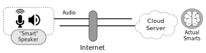
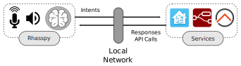
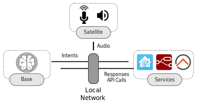
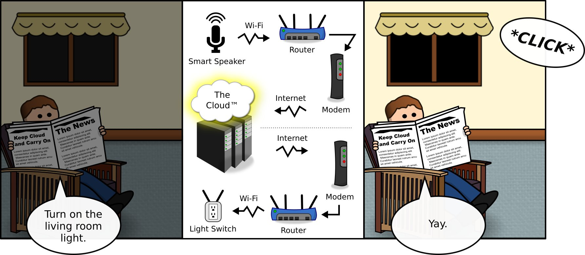

# Why Rhasspy?

## Smart Speakers and Cloud Services

A "smart" speaker really doesn't contain many smarts besides a good microphone, speakers, and a proprietary [wake word](wake-word.md) system.

The real smarts are located on the other side of the internet, on a cloud server owned by someone else.

The advantages of this approach are:

* Someone else is responsible for running the server
* Performance is not limited by local hardware
* You don't have to customize anything upfront

Unfortunately, these advantages also come with some downsides:

* Someone else is able to listen to conversations in your home
* You can't control your own devices if the internet is out
* Customization is limited to what the cloud provider offers

## Local First

A different approach involves running everything locally on your home network. With Rhasspy, the "smarts" reside on a device you control like a [Raspberry Pi](https://www.raspberrypi.org/) or an [Intel NUC](https://www.intel.com/content/www/us/en/products/boards-kits/nuc.html). When a voice command is [recognized](intent-handling.md), a local home automation service such as [Home Assistant](https://www.home-assistant.io/) or [Node-RED](https://nodered.org) responds.

The local first approach has its disadvantages:

* More expensive upfront for hardware
* Requires knowledge and maintenance of software and services
* Has to be configured and customized

However, these disadvantages come with some major upsides:

* You have complete control over your hardware, and it can be re-purposed later
* You get to choose which services to use, including combinations that no one else has thought of
* The only limits to customization are your own knowledge and time

### Base Station and Satellites

Rhasspy can be split across multiple computers, such as a [server with satellites](tutorials.md#server-with-satellites). This configuration lets you run Rhasspy's "smarts" on a more powerful base station while audio recording and playback are handled on one or more satellites around your house.

Because Rhasspy is [open source](https://github.com/rhasspy/rhasspy) and follows a well-defined [protocol](reference.md#mqtt-api), you're free to modify it to fit your exact needs. The [MIT license](license.md) allows you to do anything with the code, including commercial applications.

## Long Term Investment

An important distinction between a cloud-based and local voice assistant is what the investment of your money and time ultimately yields. For a cloud-based assistant, you get a great deal of value for very little upfront cost. The catches are:

1. The company will use your data to make money for themselves
2. The assistant will be biased towards responses that benefit the company

For this to work, the company cannot share your own data with you; this includes recorded audio and which voice commands you used. Additionally, customization cannot be allowed to overrule opportunities to make money, such as recommending specific products.

Contrast this with the local first approach:

1. All data is under your control, including the *choice* to send it to a cloud service
2. Your assistant is a tool to solve your problems, not a part of a company's strategic vision

### The Inevitable Shutdown

Over the years, we've witnessed many companies shut down home automation cloud services or switch from free to a subscription model. For the companies, this can be a positive: they've been purchased by a larger company or have grown their user base sufficiently to self-fund through subscriptions. For users, however, it is typically a negative experience.

Users invest money and time into a hardware and software ecosystem. When a "free" cloud service is a critical piece of this ecosystem, the user's long term investment can become worthless overnight. The price of convenience is paid when the service disappears, and the user is left with hardware/software that cannot fill the gap.

Rhasspy cannot replicate the full functionality of a cloud provider, but with sufficient hardware and time it can grow to fulfill a user's unique needs. Instead of starting with the question "what will this let me do?", Rhasspy invites you to ask "what do I need to do?" You wouldn't take a jet just to get to the grocery store down the street; why would you need one of the world's most sophisticated datacenters just to turn on your living room light?

[Image source](img/why-rhasspy/internet-light.svg)
